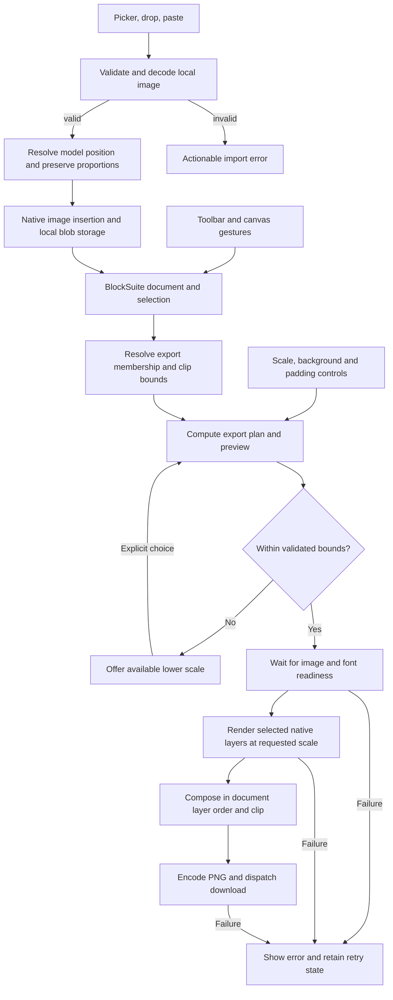

# Phase 1: Editable Canvas and Image Portability - Research

**Researched:** 2026-09-11
**Domain:** React/BlockSuite canvas incorporation, local image input, PNG rendering and browser validation
**Confidence:** MEDIUM — exact upstream source inspected; dependency installation and runtime behavior remain unverified.

<user_constraints>
## User Constraints (from CONTEXT.md)

The following decision and discretion text is copied verbatim from [01-CONTEXT.md](01-CONTEXT.md) (approved interaction and export behavior), lines 15–39. [VERIFIED: .planning/phases/01-editable-canvas-and-image-portability/01-CONTEXT.md:15-39]

<!-- DATA_84a1c932_START -->
### Canvas controls and layout
- **D-01:** Place drawing tools in a left toolbar.
- **D-02:** Show contextual controls for selected objects.
- **D-03:** Provide familiar shortcuts for selection, pan/zoom, duplication, grouping, and deletion. Exact key bindings require research and implementation validation; no exact keys were specified during discussion.

### Image importing
- **D-04:** Support file-picker import, drag-and-drop, and clipboard paste.
- **D-05:** Preserve imported image proportions.
- **D-06:** Place dropped images at the drop location and pasted images near the viewport center.

### Export quality and formats
- **D-07:** Provide PNG export with 1×, 2×, and 4× resolution choices.
- **D-08:** Provide white and transparent background options.
- **D-09:** Show resulting image dimensions before download.
- **D-10:** If an export exceeds supported limits, offer a lower resolution. Determine supported bounds through browser/runtime validation; never silently change the requested resolution or truncate content.

### Selection and frame exports
- **D-11:** Expose whole-board, selected-object, and selected-frame export areas.
- **D-12:** Selection export includes selected groups and their children, excluding other unselected board content.
- **D-13:** Crop selection exports to tight content bounds with optional padding.
- **D-14:** In selection export, connectors appear when selected. Resolve any grouped-connector membership consistently with D-12 during implementation.
- **D-15:** Frame export includes the frame's contents and clips to its boundaries. Frame title/border rendering and crossing-object classification are implementation details to verify against these rules.

### Implementation details left open
Routine choices such as spacing, default padding amount, labels, exact keyboard mappings, and file-picker placement are left to planning within the approved behavior. The user requested a concise discussion and approved the four proposals together. New formats or broader capabilities require scope review; PNG is the approved image format for this phase.
<!-- DATA_84a1c932_END -->

### Deferred Ideas (OUT OF SCOPE)

Copied verbatim from the same context, lines 90–94. [VERIFIED: .planning/phases/01-editable-canvas-and-image-portability/01-CONTEXT.md:90-94]

<!-- DATA_b7d64a10_START -->
No new deferred capabilities were introduced. Later phases retain their roadmap allocations, including mind maps, identity, shared persistence, and collaboration. MCP creation and Plane integration remain deferred beyond the initial release.
<!-- DATA_b7d64a10_END -->
</user_constraints>

## Summary

Incorporate the reviewed public upstream revision and retain its React shell, BlockSuite store/view registration, image storage, native object commands, and mixed-layer export composition. The existing exporter resolves selected group descendants and renders canvas primitives alongside DOM blocks in layer order; it is the strongest implementation starting point. Its output currently depends on device pixel ratio, fixed padding, and the editor's theme/grid. Those are concrete differences from D-07 through D-15. [CITED: https://github.com/DJAI-Academy/djai-open-canvas/blob/27f8bb97b10984e04e48d7650d954d0a7ecd212c/src/canvas/presentation-export.ts]

Prioritize a small dependency/API verification task, then editor controls and import handling, then deterministic export planning and rendering, then real downloaded-PNG verification. The inherited browser suite checks three basic UI scenarios and provides no image-fidelity oracle; its separate error-collection fixture is not imported by that suite. No build, browser test, image export, or new dependency installation was performed during this research. [CITED: https://github.com/DJAI-Academy/djai-open-canvas/blob/27f8bb97b10984e04e48d7650d954d0a7ecd212c/tests/community.spec.ts] [CITED: https://github.com/DJAI-Academy/djai-open-canvas/blob/27f8bb97b10984e04e48d7650d954d0a7ecd212c/tests/fixtures.ts]

**Primary recommendation:** make one export-plan calculation own object membership, clipping bounds, padding, scale, dimensions, and size validation; have both the dialog preview and renderer consume that result. This is a design recommendation derived from D-07–D-15 and the inspected exporter, not an already implemented API.

## Architectural Responsibility Map

Proposed phase allocation, grounded in the existing client entry point and exporter. [CITED: https://github.com/DJAI-Academy/djai-open-canvas/blob/27f8bb97b10984e04e48d7650d954d0a7ecd212c/src/App.tsx]

| Capability | Primary Tier | Secondary Tier | Rationale |
|---|---|---|---|
| Toolbar, contextual controls, gestures, shortcuts | Browser / Client | — | Operate the mounted BlockSuite editor and selection. |
| Image validation, decoding, placement | Browser / Client | Browser storage | Normalize three input methods into one insertion operation. |
| Local document and image retention | Browser storage | Browser / Client | Preserve the existing workspace lifecycle for this phase. |
| Export scope and geometry | Browser / Client | — | Resolve the current document and selected IDs before raster allocation. |
| PNG composition, preview dimensions, download | Browser / Client | — | Compose native layers, encode, and dispatch a browser download. |
| Application assets | CDN / Static | Browser / Client | Build the existing frontend; operator deployment remains a later-phase concern. |

## Project Constraints (from AGENTS.md)

Actionable project directives, condensed from [AGENTS.md](../../../AGENTS.md) (privacy, workflow, and product boundaries), lines 5–29. [VERIFIED: AGENTS.md:5-29]

- Keep repository content and publishable history organization-neutral, including planning, research caches, logs, generated evidence, commits, and PRs.
- Use synthetic examples and example domains. Exclude private organizational/customer information, identities, screenshots, host paths, credentials, tenant identifiers, production domains, deployment settings, and private evidence.
- Keep real identity and deployment settings in operator-controlled infrastructure; expose generic configuration interfaces publicly.
- Review staged changes and outgoing history before publication. Do not force-add private files. If private history is found, stop publication and prepare reviewed remediation.
- Use GSD; read approved project, requirements, and roadmap; deliver phases sequentially; research before planning, check plans before execution, verify requirements after each phase.
- Execute approved plans automatically; pause for blockers or consequential decisions. Independent tasks may run in parallel with explicit file ownership.
- Follow the model configuration; check static errors before commits; finish relevant checks before a PR; keep PR descriptions concise.
- Extend DJAI Open Canvas with applicable attribution. Keep mind maps, authentication, durable collaboration, facilitation, templates, mockups, technical diagrams, and Gantt in their approved phase allocations. Use ordinary objects for roadmaps. MCP and Plane remain deferred; ClickUp imports remain excluded.

The current workflow explicitly contains `"nyquist_validation": true`; include executable requirement verification. [VERIFIED: .planning/config.json:32-37] No project-local skill directories or graph file were found in the targeted discovery; no graph relationships were used. [VERIFIED: research discovery command, 2026-09-11]

<phase_requirements>
## Phase Requirements

Descriptions copied from [REQUIREMENTS.md](../../REQUIREMENTS.md) (approved canvas and image acceptance requirements), lines 21–26. [VERIFIED: .planning/REQUIREMENTS.md:21-26]

| ID | Description | Research Support |
|---|---|---|
| CAN-01 | Users can pan and zoom an infinite canvas and create editable frames, sticky notes, formatted text, shapes, arrows, connectors, and freehand drawings. | Preserve curated extensions and native editing; test every primitive and focus-sensitive gesture. |
| CAN-02 | Users can select, move, resize, group, align, duplicate, layer, and style canvas objects. | Reuse arrangement commands, selection rectangle and contextual inspector; assert model changes after actual UI input. |
| IMG-01 | Users can import local images, including exported Miro boards and screen captures, and arrange them on the canvas. | Consolidate picker/drop/paste; decode and validate; use model-coordinate placement and aspect-ratio checks. |
| IMG-02 | Users can export board content to an image that preserves the visible text, shapes, connectors, and uploaded images. | Retain canvas+DOM composition; explicit scale/background; decoded-download visual and pixel assertions. |
| IMG-03 | Users can select a group of shapes and export only the selected shapes as an image, excluding unselected board content. | Resolve exact selected membership plus recursive group children; preserve layer order; test overlapping excluded objects. |
</phase_requirements>

## Standard Stack

### Core and supporting baseline

Retain the reviewed lockfile for initial reproduction. These are verbatim locked versions, not claims of current registry availability or compatible runtime behavior. Every package below is **[WARNING: flagged as suspicious — verify before using.]** because the registry audit returned unknown metadata; see the audit and execution gate. No new library is necessary for the proposed phase design.

| Library | Exact baseline | Purpose | Source |
|---|---|---|---|
| BlockSuite family | `"@blocksuite/affine": "0.22.4"`; direct store/group/selected-rect/zoom/data-view packages also `"0.22.4"` | Native objects, selection, rendering | [VERIFIED: upstream/package.json:36-46] |
| React / React DOM | `"version": "18.3.1"` for each | Existing shell and dialogs | [VERIFIED: upstream/package-lock.json:6648-6663] |
| TypeScript | `"version": "5.9.3"` | Compile-time API verification | [VERIFIED: upstream/package-lock.json:7172-7177] |
| Vite | `"version": "5.4.21"` | Reproduce inherited build before isolated maintenance | [VERIFIED: upstream/package-lock.json:7415-7420] |
| React Vite plugin | `"version": "4.7.0"` | Existing React build integration | [VERIFIED: upstream/package-lock.json:4078-4083] |
| vanilla-extract Vite plugin | `"version": "4.0.19"` | Existing BlockSuite CSS integration | [VERIFIED: upstream/package-lock.json:4065-4070] |
| Signals core | `"version": "1.14.4"` | Existing editor setting signal | [VERIFIED: upstream/package-lock.json:3308-3313] |
| Vitest | `"version": "2.1.9"` | Pure geometry, membership, and validation tests | [VERIFIED: upstream/package-lock.json:7497-7502] |
| Playwright test | `"version": "1.62.1"` | Actual browser interaction and PNG downloads | [VERIFIED: upstream/package-lock.json:3292-3297] |
| Yjs, transitive | `"version": "13.6.31"` | Existing document representation | [VERIFIED: upstream/package-lock.json:7631-7636] |
| pdf-lib, inherited | `"version": "1.17.1"` | Existing upstream PDF code; no new PDF scope | [VERIFIED: upstream/package-lock.json:6490-6495] |

Source names and full pinned links: [DJAI package manifest](https://github.com/DJAI-Academy/djai-open-canvas/blob/27f8bb97b10984e04e48d7650d954d0a7ecd212c/package.json) (dependencies/scripts), [DJAI package lock](https://github.com/DJAI-Academy/djai-open-canvas/blob/27f8bb97b10984e04e48d7650d954d0a7ecd212c/package-lock.json) (exact baseline resolutions).

**Build constraints:** preserve the executable settings `target: 'es2022'` and `useDefineForClassFields: false`, vanilla-extract plugin registration, and explicit dependency optimization until equivalent behavior is proven. Source and optimizer transforms both matter. [VERIFIED: upstream/vite.config.ts:38-44,110-139] [DJAI Vite configuration](https://github.com/DJAI-Academy/djai-open-canvas/blob/27f8bb97b10984e04e48d7650d954d0a7ecd212c/vite.config.ts) (decorators, CSS, initialization and test configuration).

**Maintenance decision:** the current Vite support page explicitly states that versions before the listed maintained lines are unsupported; the inherited Vite release therefore requires an isolated maintenance task before exposing a development server beyond local verification. Reconfirm the maintained target and compatible plugin/test versions during that task. Do not invent a tested replacement combination. [CITED: https://vite.dev/releases]

**Installation after the dependency gate:** run `npm ci` using the reviewed lockfile, then `npm run typecheck`, `npm test`, `npm run build`, and `npm run test:browser`. Existing script values are `"typecheck": "tsc --noEmit"`, `"test": "vitest run"`, `"build": "tsc --noEmit && vite build"`, and `"test:browser": "playwright test"`. [VERIFIED: upstream/package.json:22-34]

### Alternatives considered

| Instead of | Use | Planning rationale |
|---|---|---|
| New canvas engine | Existing pinned BlockSuite adapter | Foundation is locked by project scope. |
| Whole-screen screenshot export | Native canvas/DOM layer export | Need offscreen content, exact membership, and high-resolution text. |
| New PNG encoding library | Browser canvas encoding | Browser PNG output is documented; retain the null/error checks. [CITED: https://developer.mozilla.org/en-US/docs/Web/API/HTMLCanvasElement/toBlob] |
| Large dependency upgrade bundled into feature work | Baseline reproduction plus isolated maintenance | Makes decorator/CSS regressions diagnosable. |

## Package Legitimacy Audit

The required seam was run against all 19 inherited direct dependencies and dev dependencies. It returned `SUS` for every entry with `exists: null`, `publishedAt: null`, `weeklyDownloads: null`, `repoUrl: null`, and `postinstall: null`. The explicit registry probe failed with `getaddrinfo ENOTFOUND registry.npmjs.org`. This supplies **no observation** of registry age, downloads, repository ownership, deprecation, or install scripts; it does not establish malicious packages. [VERIFIED: package-legitimacy and npm probe output, 2026-09-11]

| Package set | Registry | Age / downloads / repo / postinstall | Verdict | Disposition |
|---|---|---|---|---|
| Six direct BlockSuite packages in the manifest | npm | Unavailable — network lookup failed | SUS | Flagged; repeat provenance check before install |
| React, React DOM, signals core, pdf-lib | npm | Unavailable — network lookup failed | SUS | Flagged; repeat provenance check before install |
| Playwright, three type packages, two Vite plugins, TypeScript, Vite, Vitest | npm | Unavailable — network lookup failed | SUS | Flagged; repeat provenance check before install |

**Exact audited names:** `@blocksuite/affine`, `@blocksuite/affine-gfx-group`, `@blocksuite/affine-widget-edgeless-selected-rect`, `@blocksuite/affine-widget-edgeless-zoom-toolbar`, `@blocksuite/store`, `@blocksuite/data-view`, `@preact/signals-core`, `pdf-lib`, `react`, `react-dom`, `@playwright/test`, `@types/node`, `@types/react`, `@types/react-dom`, `@vanilla-extract/vite-plugin`, `@vitejs/plugin-react`, `typescript`, `vite`, `vitest`. [VERIFIED: upstream/package.json:36-57]

**Gate:** retry metadata and official-source verification in the execution environment, inspect exact-version install scripts and package licenses, and review the final lockfile. If a real `SUS` verdict remains after successful retrieval, include `checkpoint:human-verify` before that install. No package earned `[VERIFIED: npm registry]`; publish dates remain unknown. **SLOP removals:** none. Avoid treating the network-failure batch as 19 independently proven supply-chain incidents.

## Architecture Patterns

### System architecture diagram

Proposed processing flow implementing the approved decisions:



### Component responsibilities

Paths below identify inspected upstream seams; proposed additions should remain beside those seams, with file names chosen by the planner. They are not claims that Dali implementation files already exist.

| Component | Reuse / planned change | Evidence |
|---|---|---|
| Editor bootstrap and runtime | Retain shared runtime and disposable view; preserve mode and viewport wrapper | [DJAI editor bootstrap](https://github.com/DJAI-Academy/djai-open-canvas/blob/27f8bb97b10984e04e48d7650d954d0a7ecd212c/src/canvas/blocksuite-editor.ts) |
| Canvas controls | Move drawing-tool surface to left; retain image entry and selection inspector | [DJAI canvas integration](https://github.com/DJAI-Academy/djai-open-canvas/blob/27f8bb97b10984e04e48d7650d954d0a7ecd212c/src/canvas/BlockSuiteCanvas.tsx) |
| Arrangement adapter | Retain native grouping, order and geometry mutation commands | [DJAI arrangement](https://github.com/DJAI-Academy/djai-open-canvas/blob/27f8bb97b10984e04e48d7650d954d0a7ecd212c/src/canvas/arrangement.ts) |
| Image input adapter, proposed | Normalize input methods, validate, decode, convert placement, insert once | Derived design from D-04–D-06 |
| Export plan, proposed | Pure membership/geometry rules shared by dialog and renderer | Derived design from D-07–D-15 |
| Presentation renderer | Preserve mixed layers, introduce real render scale and exact clipping | [DJAI presentation renderer](https://github.com/DJAI-Academy/djai-open-canvas/blob/27f8bb97b10984e04e48d7650d954d0a7ecd212c/src/canvas/presentation-export.ts) |
| Export dialog and dispatch | PNG areas/scales/background/preview; explicit lower-scale choice and retry | [DJAI export dialog](https://github.com/DJAI-Academy/djai-open-canvas/blob/27f8bb97b10984e04e48d7650d954d0a7ecd212c/src/header/ExportDialog.tsx), [DJAI download dispatch](https://github.com/DJAI-Academy/djai-open-canvas/blob/27f8bb97b10984e04e48d7650d954d0a7ecd212c/src/canvas/export-board.ts) |

### Pinned API guidance and technical checkpoints

1. **Editor lifecycle:** the source constructs `new BlockStdScope`, uses `viewManager.get('edgeless')`, registers `DocModeExtension`, renders the host, and waits for `host.updateComplete`. Preserve this sequence and disposable view ownership. The exact mode value is `'edgeless'`; viewport class is `'affine-edgeless-viewport'`. [VERIFIED: upstream/src/canvas/blocksuite-editor.ts:27-84,98-114]
2. **Selection and grouping:** retrieve the controller through `host.std.get(GfxControllerIdentifier)`; selected models come from `selection.selectedElements`. Native grouping uses `host.std.command.exec(createGroupFromSelectedCommand)`, bracketed by `captureSync()`. Retain native group IDs and descendant relationships. [VERIFIED: upstream/src/canvas/arrangement.ts:111-129]
3. **Image insertion:** the picker already calls `await addImages(host.std, files, { maxWidth: MAX_IMAGE_WIDTH });`. Preserve that verified call shape. The definition of its placement option, decoder behavior, clipboard ownership, and drop registration was not available in installed package source. The executor must open the exact 0.22.4 implementation before adding arguments; do not assume the coordinate type from a comment. [VERIFIED: upstream/src/canvas/BlockSuiteCanvas.tsx:115-133]
4. **Layer rendering:** the source imports `CanvasRenderer` and `ExportManager` from `'@blocksuite/affine/blocks/surface'`, then calls `surface.renderer.getCanvasByBound(bound, elements)` for primitive layers and `manager.edgelessToCanvas(surface.renderer, bound, gfx, elements, [])` for DOM layers. These are verified call sites, not proof of optional scale arguments. [VERIFIED: upstream/src/canvas/presentation-export.ts:1-11,175-203]
5. **Scale checkpoint:** inspect the installed definitions of both rendering methods and their delegated DOM rasterizer. Prove a scale-controlled path for both primitive and DOM content at 1×/2×/4× before completing the renderer task. Increasing only the final canvas dimensions resamples the existing bitmap and cannot establish true higher-resolution rendering. This last statement is a rendering inference; the proposed implementation must verify it with a fine-line/text fixture.
6. **Import event ownership:** determine whether the pinned view already handles image drop/paste. Keep one consumer for image files; intercept only supported image payloads, while ordinary text editing and native object copy/paste retain their own paths. Confirm a single insertion per event. This is an implementation prescription, not an observed package guarantee.

### Defaults for planning within approved discretion

These are recommended implementation choices under the context's delegated discretion, not newly locked requirements.

| Decisions | Concrete default |
|---|---|
| D-01–D-02 | One left drawing toolbar; contextual style controls adjacent to selection; retain discoverable labels and keyboard focus. Inspect toolbar DOM/extension APIs before choosing repositioning versus an application wrapper. |
| D-03 | Select: V; temporary pan: Space+drag and middle-button drag; duplicate: platform modifier+D; group: modifier+G; ungroup: modifier+Shift+G; delete: Delete/Backspace. Reuse native bindings when equivalent; define conflicts and rich-text focus behavior in tests. Pointer-centered wheel zoom is the existing configured setting. |
| D-04–D-06 | Picker/paste near viewport center; drop at cursor mapped into model space; preserve width/height ratio. Support PNG and JPEG first as a proposed minimum, with other decoded raster formats only after equivalent validation. |
| D-07–D-10 | Default 1×, white background; available scales exactly 1×/2×/4×. Compute dimensions from world-space content geometry, independent of screen DPR and current zoom. Offer the highest lower supported choice explicitly. |
| D-11–D-13 | Default whole board; selection disabled when empty; frame enabled for one selected frame. Selection padding defaults to zero, with a bounded optional nonnegative padding control. |
| D-14 | Include explicitly selected connectors and connector descendants of selected groups. Do not auto-include a connector solely because one or both endpoints are selected. |
| D-15 | Use the selected frame's world rectangle as the final crop, zero outside padding. Include intersecting content and clip crossing objects; omit the selected frame's editor title/border. Preserve ordinary nested content layer order. |

The actual upstream wheel configuration is `setting$: signal({ edgelessScrollZoom: true })`. Exact suggested keyboard bindings above still require package inspection and runtime validation. [VERIFIED: upstream/src/canvas/blocksuite-editor.ts:61-67]

### Export-plan rules

Design prescriptions derived from D-07–D-15:

- Resolve selected IDs before asynchronous rendering. Freeze a consistent object-membership snapshot and verify the board/selection has not changed before dispatch, or recompute and update the preview.
- Expand selected groups recursively into a deduplicated ID set. Traverse `gfx.layer.layers` for rendering order, rather than selection order.
- Use visible geometry for bounds, including rotated shapes, strokes, connector arrowheads/labels, and nested groups. Validate the pinned model bounds empirically; zero-size content must still yield a valid nonempty output or an explicit error.
- Proposed dimension formula: `width = ceil((contentWidth + 2 * padding) * scale)`, with the corresponding height formula. Reject nonfinite/negative dimensions and arithmetic overflow before allocation.
- Frame output uses the frame rectangle and zero outer padding. Apply an explicit output clip, even if a renderer returns pixels outside its declared layer bounds.
- Resolve all image blobs and font readiness before producing a successful export. Missing assets must fail with actionable retry, not silently produce a blank patch.
- A single RGBA output has `width * height * 4` bytes; total peak memory also includes layer canvases, decoded images and encoding. The source's estimated byte count covers only the output allocation. [VERIFIED: upstream/src/canvas/presentation-export.ts:209-215]
- Treat the source's `MAX_OUTPUT_SIDE = 16_384`, `MAX_OUTPUT_PIXELS = 64_000_000`, and `EXPORT_PADDING = 50` as inherited constants, not validated browser limits. D-10 requires measured supported bounds and explicit resolution recovery. [VERIFIED: upstream/src/canvas/presentation-export.ts:30-32]

## Don't Hand-Roll

| Problem | Use instead | Why |
|---|---|---|
| Selection, grouping, resizing, layering, text editing | Pinned native BlockSuite commands/models and existing arrangement adapter | Preserve document semantics and integration with the native canvas. [CITED: https://github.com/DJAI-Academy/djai-open-canvas/blob/27f8bb97b10984e04e48d7650d954d0a7ecd212c/src/canvas/arrangement.ts] |
| Rich text and uploaded-image rasterization | Existing ExportManager alongside CanvasRenderer | Source already separates DOM and primitive rendering and composites their layers. [CITED: https://github.com/DJAI-Academy/djai-open-canvas/blob/27f8bb97b10984e04e48d7650d954d0a7ecd212c/src/canvas/presentation-export.ts] |
| PNG encoder | Browser `toBlob` with null/exception handling | PNG support and failure modes are documented. [CITED: https://developer.mozilla.org/en-US/docs/Web/API/HTMLCanvasElement/toBlob] |
| Browser interaction/test harness | Existing Playwright plus shared fixtures | Supports real input and download capture; augment the existing suite's oracles. [CITED: https://playwright.dev/docs/input] [CITED: https://playwright.dev/docs/downloads] |

## Runtime State Inventory

Source incorporation may include branding changes; inventory storage before any namespace refactor. Operator browsers and services were not inspected, so the table distinguishes source evidence from unknown runtime state.

| Category | Items found / evidence | Action required |
|---|---|---|
| Stored data | `const DB_NAME = 'djai-storyboard';` [VERIFIED: upstream/src/canvas/workspace.ts:20-26]; `const CATALOG_KEY = 'djai-design.board-catalog.v1';` [VERIFIED: upstream/src/boards/catalog.ts:1-3] | Preserve keys during initial incorporation, or explicitly design a tested migration. A display-name change does not require a storage-key change. Existing operator records are unknown. |
| Live service config | Operator service configuration not inspected; Phase 1 scope is frontend incorporation. | No live service mutation in this phase. Keep generic public configuration. |
| OS-registered state | No OS registrations inspected or required by phase scope. | No task to rename services or scheduled jobs. Do not claim an exhaustive machine inventory. |
| Secrets/env vars | Build source uses `const base = process.env.DEPLOY_BASE ?? '/';` [VERIFIED: upstream/vite.config.ts:28-32] | Preserve a generic build-base interface; operator values remain external. No real credentials were read. |
| Build artifacts / installed packages | The targeted directory check found no upstream node_modules; no Dali application manifest existed in the targeted test/config inventory. [VERIFIED: research environment probes, 2026-09-11] | Reproduce dependencies in Dali only; regenerate build output and synthetic screenshots. Do not copy node_modules, generated distribution assets, or deployment-specific documents wholesale. |

Additional preference definitions are `'djai-design.active-board'`, `'djai-design.open-board-once'`, and `'djai-design.pending-board-removal'`. [VERIFIED: upstream/src/boards/preferences.ts:1-3] Preserve their behavior during initial source adoption; never run broad string replacement across persistence keys.

## Common Pitfalls

| Pitfall | Evidence and prevention |
|---|---|
| Output depends on monitor density | Renderer uses `const dpr = window.devicePixelRatio || 1;`. Replace with requested export scale throughout the actual rendering path; verify equal dimensions at browser DPR 1 and 2. [VERIFIED: upstream/src/canvas/presentation-export.ts:151-167] |
| Opaque export paints paper/grid | The existing drawPaperGround reads theme colors and paints dots. Replace opaque output with explicit white and test blank-corner RGB/alpha. [CITED: https://github.com/DJAI-Academy/djai-open-canvas/blob/27f8bb97b10984e04e48d7650d954d0a7ecd212c/src/canvas/presentation-export.ts] |
| Selection leaks overlapping objects | Keep the included-ID filter for every layer. Test unselected objects both outside and overlapping the selection crop. [CITED: https://github.com/DJAI-Academy/djai-open-canvas/blob/27f8bb97b10984e04e48d7650d954d0a7ecd212c/src/canvas/presentation-export.ts] |
| Frame crop retains an outer margin | Inherited allocation applies fixed padding to every scope. Make the frame output rectangle authoritative and test crossing objects at all four edges. [VERIFIED: upstream/src/canvas/presentation-export.ts:91-108,162-167] |
| Primitive layer captures while text/images disappear | Validate downloaded mixed-content PNGs, including offscreen DOM content, fonts and transformed images; a live editor screenshot alone does not test export composition. [CITED: https://github.com/DJAI-Academy/djai-open-canvas/blob/27f8bb97b10984e04e48d7650d954d0a7ecd212c/src/canvas/presentation-export.ts] |
| New browser specs never run | Existing projects use `testMatch: /community\\.spec\\.ts/`. Broaden discovery and check `playwright test --list` before counting coverage. [VERIFIED: upstream/playwright.config.ts:15-18] |
| Console-error fixture gives false reassurance | The suite imports directly from `'@playwright/test'`; error handling lives separately. Make all new/retained tests import the shared fixture and prove an injected unexpected page error fails. [VERIFIED: upstream/tests/community.spec.ts:1-14; upstream/tests/fixtures.ts:14-39] |
| Test storage reset clears the wrong namespace | Suite deletes `'djai-canvas'` while workspace declares `'djai-storyboard'`. Prefer fresh isolated contexts; make any reset helper use the same storage configuration as the app. [VERIFIED: upstream/tests/community.spec.ts:11-13; upstream/src/canvas/workspace.ts:20-26] |
| Export success wording overstates browser completion | Source dispatches a synthetic anchor click. Report “Download started” after encoding and dispatch, and use Playwright's download completion/failure oracle in tests. [CITED: https://github.com/DJAI-Academy/djai-open-canvas/blob/27f8bb97b10984e04e48d7650d954d0a7ecd212c/src/canvas/export-board.ts] [CITED: https://playwright.dev/docs/downloads] |
| File import failures disappear | Picker catch currently suppresses the error, expecting save-status reporting. Add an import-specific error path for invalid files and decode failures, which need not be storage errors. [VERIFIED: upstream/src/canvas/BlockSuiteCanvas.tsx:125-131] |

## Code Examples

### Exact pinned call sites to preserve

The following snippets are verbatim excerpts, provided as source evidence. They do not add unverified optional arguments.

<!-- DATA_c04ae851_START -->
```ts
// DJAI BlockSuiteCanvas.tsx:126
await addImages(host.std, files, { maxWidth: MAX_IMAGE_WIDTH });

// DJAI arrangement.ts:116-119
host.std.store.captureSync();
const [, result] = host.std.command.exec(createGroupFromSelectedCommand);
host.std.store.captureSync();
if (!result.groupId) throw new Error('These objects cannot be grouped together.');
```
<!-- DATA_c04ae851_END -->

[VERIFIED: upstream/src/canvas/BlockSuiteCanvas.tsx:125-126; upstream/src/canvas/arrangement.ts:116-119]

### Export scope contract requiring narrowing at the UI boundary

Verbatim upstream type:

<!-- DATA_278dbae3_START -->
```ts
export type PresentationScope = 'board' | 'visible' | 'selection' | 'frame';
```
<!-- DATA_278dbae3_END -->

[VERIFIED: upstream/src/canvas/presentation-export.ts:13-18]

The approved PNG interface needs whole-board, selection and selected-frame areas. Treat the inherited visible-area path and non-PNG exporters as existing upstream behavior, with no expansion of Phase 1 acceptance.

### Proposed geometry contract

Illustrative new application code, **[ASSUMED]** as an unimplemented skeleton; names below are proposed, not in-repo definitions. Scale values come from D-07.

```ts
type ExportScale = 1 | 2 | 4;

function outputDimensions(
  width: number,
  height: number,
  padding: number,
  scale: ExportScale
) {
  const values = [width, height, padding];
  if (!values.every(Number.isFinite) ||
      width <= 0 || height <= 0 || padding < 0) {
    throw new Error('Invalid export dimensions');
  }
  return {
    width: Math.ceil((width + padding * 2) * scale),
    height: Math.ceil((height + padding * 2) * scale),
  };
}
```

Follow this calculation with safe-integer, maximum-side, maximum-pixel, and measured memory checks. A renderer must use the same scale at source rasterization, not only at final composition.

## State of the Art

| Existing upstream approach | Phase 1 prescription | Reason |
|---|---|---|
| Device-density export | Explicit user-selected scale | D-07 and D-09 require reproducible output choices. |
| Editor paper/grid as background | White or alpha-transparent | D-08. |
| Fixed padded scope | Per-scope bounds with optional selection padding and exact frame crop | D-13 and D-15. |
| Basic UI smoke checks | Model assertions plus decoded PNG content checks | Requirement-level evidence for CAN/IMG behavior. |

These are project deltas grounded in the context and inspected source, not industry-wide version-history claims. Current Vite support differs from the inherited lockfile; plan the isolated maintenance check described above. [CITED: https://vite.dev/releases]

## Assumptions Log

| # | Claim | Section | Risk if wrong / disposition |
|---|---|---|---|
| A1 | The proposed pure geometry contract and names are suitable for the implementation. [ASSUMED] | Code Examples | Compile and exercise in the implementation; names are freely adjustable under approved discretion. |
| A2 | Native pinned export internals expose a usable way to control source raster scale. [ASSUMED] | Pinned API checkpoint | Inspect exact installed source and run a mixed-layer scale spike before committing to the implementation approach. If unsupported, return a concrete narrow adapter proposal for scope review. |
| A3 | PNG/JPEG form an adequate initial local-image format set. [ASSUMED] | Defaults | User specified local images but no exhaustive accepted list. Treat as a proposed minimum; document actual supported formats and escalate only if implementation would reject a required source image. |

Routine defaults are delegated planning choices, not externally verified facts. Browser limits and integration compatibility remain unresolved rather than asserted.

## Open Questions

Each question below is **RESOLVED as a planning disposition; execution proof remains pending**. These dispositions specify ownership, acceptance and stop paths, and establish no runtime result.

1. **How do the exact 0.22.4 renderers accept scale? — RESOLVED (planning disposition; execution proof pending).** Task **01-04-01** in [01-04-PLAN.md](01-04-PLAN.md) (native source-scale proof and whole-board PNG) inspects installed renderer/DOM-rasterizer declarations and proves both layer types at 1×/2×/4× before adapter acceptance. Use a proven native path or prove a narrow internal adapter. If installed APIs cannot provide the required source resolution within this integration, stop that task with the exact unsupported seam and a concrete architecture choice; preserve requested output quality.
2. **Which handlers already own drop and clipboard image input? — RESOLVED (planning disposition; execution proof pending).** Tasks **01-03-01** and **01-03-02** in [01-03-PLAN.md](01-03-PLAN.md) (validated native input adapter and event ownership) inspect the installed insertion and event-registration code before adding arguments/listeners. One owner handles each image event, with real browser tests for single insertion and intact text/object paste. If no safe insertion or event-ownership seam exists, stop the affected task with the exact missing contract and proposed scoped alternative.
3. **What output bounds can the supported browsers sustain? — RESOLVED (planning disposition; execution proof pending).** Task **01-04-02** in [01-04-PLAN.md](01-04-PLAN.md) (bounded probes and explicit lower-scale recovery) measures conservative side/pixel ceilings with bounded synthetic allocations, records browser/version and fixture class, and tests preflight rejection, encoding errors and explicit lower-scale selection. Unmeasured ceilings cannot be certified; unavailable measurements remain a blocked validation item for that browser.
4. **Can the inherited toolchain install/build in the execution environment? — RESOLVED (planning disposition; execution proof pending).** Task **01-01-01** in [01-01-PLAN.md](01-01-PLAN.md) (provenance and locked-baseline reproduction) retries registry/official-source checks and verifies the installed baseline. Task **01-01-02** (isolated maintained-toolchain validation) verifies any replacement build-tool versions. A DNS failure records unavailable metadata; unresolved provenance after successful retrieval requires the specified pre-install checkpoint. An actual connectivity or compatibility blocker stops dependent execution with its evidence.
5. **Which desktop browsers are release targets? — RESOLVED (planning disposition; execution proof pending).** The execution matrix is Chromium development and production, plus Firefox and WebKit production image smoke. Task **01-01-01** creates the projects; **01-03-02**, **01-04-02** and **01-05-02** in [01-03-PLAN.md](01-03-PLAN.md) (image input), [01-04-PLAN.md](01-04-PLAN.md) (export bounds/recovery) and [01-05-PLAN.md](01-05-PLAN.md) (selection/frame workflow) supply their cases. This selects validation coverage; support claims require passed evidence, and unavailable or failing browsers remain explicit coverage gaps.

## Environment Availability

| Dependency | Required by | Observed availability | Version | Fallback / next step |
|---|---|---|---|---|
| Node.js | Build and test | Available | `v26.7.0` | Run the baseline; pin a verified supported CI runtime during implementation. |
| npm | Locked dependency retrieval | Available | `11.19.0` | Registry DNS currently fails in this research environment. |
| Python | Optional fixture inspection | Available | `3.14.7` | Native browser PNG decode also provides an oracle; no Python package install proposed. |
| Installed upstream dependencies | API inspection/build | Directory absent at targeted path | — | Install only in Dali after the dependency gate. |
| Context7 MCP / ctx7 CLI | Documentation lookup | No callable MCP provider found; CLI lookup empty | — | Used public upstream code and official browser/testing docs. |
| Playwright browsers | Runtime verification | Not launched or version-probed | — | Install project-matched browsers during test setup. |
| External databases / identity / services | Later phases | Not required for this phase | — | Preserve scope sequence. |

[VERIFIED: research command probes, 2026-09-11] Node availability is not a claim of tested build compatibility. Missing registry connectivity blocks package verification/installation in this environment; it does not block planning.

## Validation Architecture

### Test framework

The inspected configuration uses `environment: 'node'`, `include: ['src/**/*.test.ts']`, and `passWithNoTests: true` for Vitest. Browser projects are named `'dev'` and `'prod'`, using Desktop Chrome. [VERIFIED: upstream/vite.config.ts:134-140; upstream/playwright.config.ts:14-18]

| Property | Value |
|---|---|
| Unit framework | Inherited Vitest 2.1.9; pure data/geometry functions |
| Browser framework | Inherited Playwright 1.62.1; native canvas/DOM and actual downloads |
| Existing configuration | Upstream Vite and Playwright configs; adapt test discovery in Dali |
| Quick check | `npm test -- src/canvas/export-plan.test.ts` — proposed file, Wave 0 |
| Static check | `npm run typecheck` |
| Full suite | `npm test && npm run build && npm run test:browser` |
| Discovery check | `npm exec playwright test -- --list` |

Commands naming new tests below are proposed plan targets. No Dali test files existed at research time; create them during execution. Fast unit checks should target under 30 seconds; full browser/build startup duration must be measured, not promised.

### Phase requirements → test map

| Requirement / decisions | Behavior and oracle | Test type | Proposed automated command | File exists? |
|---|---|---|---|---|
| CAN-01, D-01–D-03 | Create/edit every primitive; pan/zoom; rich-text focus; drawing toolbar on left; contextual controls | Browser UI plus model state | `npm exec playwright test -- tests/canvas-editing.spec.ts --project=dev` | No — Wave 0 |
| CAN-02, D-02–D-03 | Select/move/resize/group/align/duplicate/order/style; assert IDs, bounds, group membership and model properties | Browser | `npm exec playwright test -- tests/canvas-arrangement.spec.ts --project=dev` | No — Wave 0 |
| IMG-01, D-04–D-06 | Picker/drop/paste each create exactly one image; ratio and placement under changed viewport; retry invalid/decode error | Browser plus input-validation unit tests | `npm exec playwright test -- tests/image-import.spec.ts --project=dev` | No — Wave 0 |
| IMG-02, D-07–D-10 | Real PNG decoded dimensions equal preview at 1×/2×/4× and browser DPR 1/2; RGB/alpha; all mixed-content landmarks; limit fallback | Unit plus browser download | `npm exec playwright test -- tests/image-export.spec.ts --project=prod` | No — Wave 0 |
| IMG-03, D-11–D-14 | Selected nested groups include descendants; overlapping unselected content excluded; connectors follow explicit/group membership | Unit set assertions plus downloaded pixel evidence | `npm test -- src/canvas/export-plan.test.ts`; `npm exec playwright test -- tests/image-export.spec.ts --project=prod` | No — Wave 0 |
| IMG-02/03, D-15 | Selected frame includes/clips crossing content at exact dimensions, including grouped and DOM objects | Browser PNG oracle | `npm exec playwright test -- tests/image-export.spec.ts --project=prod` | No — Wave 0 |
| All, public boundary | Static errors, console exceptions, immutable attribution, sanitized source/evidence inventory | Static, browser, review | `npm run typecheck`; `npm run build`; relevant browser suite | Inherited partial setup only |

### Required fixture and oracle design

Proposed test design derived from the phase requirements:

- Generate a synthetic mixed board with a formatted heading, sticky note, rectangle, rotated shape, arrow, connector label, freehand stroke, PNG reference image, frame, nested group, and overlapping unselected bright marker.
- Give each positive/negative object a unique color or simple pixel landmark. Verify model IDs separately from visual landmarks so a fake screenshot or a fabricated state cannot satisfy both oracles.
- Capture the **downloaded** PNG. Parse its signature and IHDR dimensions using built-in buffer operations, then decode it in a browser canvas and assert landmark colors/alpha and clipping. Use visual snapshots for text and fine lines with a documented tolerance; never equate a nonempty Blob or download event with visual fidelity.
- For scales, keep world geometry identical across DPR 1/2 and different viewport zoom values. Expected pixel dimensions must equal the preview, and fine-line/text fidelity must distinguish real higher-resolution rendering from bitmap enlargement.
- For selection, include nested groups, an explicitly selected connector with unselected endpoints, an unselected connector with selected endpoints, a connector inside a selected group, and content overlapping the crop but outside membership.
- For frames, test fully contained, crossing, outside, nested-group, text/image, and connector objects. Verify all four crop edges and no added outside margin.
- For inputs, test portrait/landscape images, duplicate imports of the same file, corrupt bytes, renamed nonimage files, cancelled picker, and large decoded dimensions. Test drop coordinates after pan/zoom and paste while editing text.
- Test preflight limit rejection without allocating the dangerous canvas; separately run a bounded browser stress probe to establish actual supported ceilings. Exercise encoding null/error, missing image, font readiness, retry, and explicit lower-scale choice.
- Use real UI actions for acceptance; direct document seeding is allowed for constructing known export fixtures. Synthetic clipboard/drop event tests establish handler integration; pair them with a native clipboard/drag smoke where the automation environment permits it, and label any remaining OS-path gap.
- New tests should import the shared error fixture, run in isolated browser contexts, and assert no unexpected console/page errors. Synthetic screenshots alone may be committed; private browser traces remain external.

Playwright documents buffer-based file upload and download completion handling. [CITED: https://playwright.dev/docs/input] [CITED: https://playwright.dev/docs/downloads]

### Sampling rate

- Per task commit: typecheck and focused unit/browser tests for the touched behavior.
- Per wave: all unit tests and the affected development/production browser paths.
- Phase gate: full suite green, decoded-PNG evidence for IMG-02/03, and a requirement-by-requirement record of passed/failed/blocked checks. No claim of Phase 1 completion until CAN-01, CAN-02, IMG-01, IMG-02, IMG-03 and D-01–D-15 have evidence.

### Wave 0 gaps

- Incorporate reviewed source and lockfile with notices and a public-content audit.
- Recover package verification, install dependencies and project-matched browsers, record baseline failures faithfully.
- Add the proposed export-plan unit file and four browser feature specs.
- Broaden browser test discovery and ensure every spec imports the error-checking fixture.
- Replace stale namespace cleanup with isolated-context setup and explicit test-board initialization.
- Add synthetic image generation, mixed-board construction, PNG decode/pixel assertions, stable font readiness, and deterministic viewport fixtures.
- Ensure a missing targeted suite fails rather than passing through the inherited `passWithNoTests: true` setting.
- Record the measured browser bounds and exact runtime/build versions as sanitized test metadata.

## Security Domain

Security enforcement has no explicit false setting in the inspected configuration, so include this section. Applicability below is a Phase 1 design assessment. Category labels are explicitly **ASVS 4.x** labels matching the requested planning template; ASVS 5 uses different numbering. [CITED: https://devguide.owasp.org/en/08-culture-process/04-asvs/] [CITED: https://owasp.org/www-project-application-security-verification-standard/]

| ASVS 4.x category | Applies in Phase 1 | Standard control / scope |
|---|---|---|
| V2 Authentication | Deferred to Phase 3 | No production authentication claim in Phase 1. |
| V3 Session Management | Deferred to Phase 3 | Local editor lifecycle only. |
| V4 Access Control | Deferred to Phase 3 | Do not claim local storage provides authorized multiuser board access. |
| V5 Validation, Sanitization and Encoding | Yes | Validate image payloads, bounded dimensions, finite geometry and scale; preserve framework escaping and native rich-text handling. |
| V6 Stored Cryptography | No new cryptographic function | Use platform/library facilities for existing storage identifiers; no custom crypto. |

| Threat pattern | STRIDE | Proposed mitigation / validation |
|---|---|---|
| Oversized decoded image or export allocation | Denial of service | Bounded byte/dimension checks, explicit errors, measured ceilings and lower-scale recovery. |
| Untrusted pasted HTML or active image content | Tampering / elevation | Preserve native sanitization; validate actual decoded image bytes; do not inject pasted markup into app chrome. Rasterize or explicitly reject active formats until a safe supported path is verified. |
| Cross-origin pixels make canvas unexportable | Denial of service | Use imported local blobs; resolve all assets; handle origin-clean failures explicitly. MDN documents canvas taint behavior. [CITED: https://developer.mozilla.org/en-US/docs/Web/HTML/How_to/CORS_enabled_image] |
| Public test/log leakage | Information disclosure | Synthetic fixtures and example domains; inspect copied docs/assets, generated evidence, staged changes and publishable history. [VERIFIED: AGENTS.md:5-11] |
| Dependency metadata unavailable | Tampering risk, unassessed | Complete the package gate; keep source pin and lockfile; never infer safety from a failed lookup. |

## Sources

### Primary code evidence

All upstream code references use **DJAI Academy, djai-open-canvas**, immutable revision `27f8bb97b10984e04e48d7650d954d0a7ecd212c`, confirmed by local Git inspection. Source facts were read with numbered file output; findings about package behavior beyond those call sites remain unverified. [VERIFIED: upstream Git revision/status probe, 2026-09-11]

- [DJAI package manifest](https://github.com/DJAI-Academy/djai-open-canvas/blob/27f8bb97b10984e04e48d7650d954d0a7ecd212c/package.json) (direct dependencies and scripts).
- [DJAI package lock](https://github.com/DJAI-Academy/djai-open-canvas/blob/27f8bb97b10984e04e48d7650d954d0a7ecd212c/package-lock.json) (exact baseline versions).
- [DJAI editor bootstrap](https://github.com/DJAI-Academy/djai-open-canvas/blob/27f8bb97b10984e04e48d7650d954d0a7ecd212c/src/canvas/blocksuite-editor.ts) (mode, viewport and lifecycle).
- [DJAI extensions](https://github.com/DJAI-Academy/djai-open-canvas/blob/27f8bb97b10984e04e48d7650d954d0a7ecd212c/src/canvas/extensions.ts) (native model/view registrations).
- [DJAI image/control integration](https://github.com/DJAI-Academy/djai-open-canvas/blob/27f8bb97b10984e04e48d7650d954d0a7ecd212c/src/canvas/BlockSuiteCanvas.tsx) (picker and inspectors).
- [DJAI presentation rendering](https://github.com/DJAI-Academy/djai-open-canvas/blob/27f8bb97b10984e04e48d7650d954d0a7ecd212c/src/canvas/presentation-export.ts) (membership, geometry, mixed layers).
- [DJAI workspace](https://github.com/DJAI-Academy/djai-open-canvas/blob/27f8bb97b10984e04e48d7650d954d0a7ecd212c/src/canvas/workspace.ts), [catalog](https://github.com/DJAI-Academy/djai-open-canvas/blob/27f8bb97b10984e04e48d7650d954d0a7ecd212c/src/boards/catalog.ts), [preferences](https://github.com/DJAI-Academy/djai-open-canvas/blob/27f8bb97b10984e04e48d7650d954d0a7ecd212c/src/boards/preferences.ts) (storage definitions).
- [DJAI tests](https://github.com/DJAI-Academy/djai-open-canvas/blob/27f8bb97b10984e04e48d7650d954d0a7ecd212c/tests/community.spec.ts), [test fixture](https://github.com/DJAI-Academy/djai-open-canvas/blob/27f8bb97b10984e04e48d7650d954d0a7ecd212c/tests/fixtures.ts), [Playwright config](https://github.com/DJAI-Academy/djai-open-canvas/blob/27f8bb97b10984e04e48d7650d954d0a7ecd212c/playwright.config.ts) (coverage and discovery).
- [DJAI MIT license](https://github.com/DJAI-Academy/djai-open-canvas/blob/27f8bb97b10984e04e48d7650d954d0a7ecd212c/LICENSE) (preserve the applicable copyright and permission notice when incorporating source).

### Official documentation — MEDIUM confidence

- MDN, [HTMLCanvasElement.toBlob](https://developer.mozilla.org/en-US/docs/Web/API/HTMLCanvasElement/toBlob) (PNG, null result, origin-clean exceptions; page modified 2026-02-12).
- MDN, [Use cross-origin images in a canvas](https://developer.mozilla.org/en-US/docs/Web/HTML/How_to/CORS_enabled_image) (tainted canvas behavior).
- Playwright, [Actions](https://playwright.dev/docs/input), [Downloads](https://playwright.dev/docs/downloads), [Installation](https://playwright.dev/docs/intro) (input and download test mechanisms).
- Vite, [Releases](https://vite.dev/releases) (explicit maintained-version policy).
- OWASP, [ASVS developer guide](https://devguide.owasp.org/en/08-culture-process/04-asvs/), [ASVS project](https://owasp.org/www-project-application-security-verification-standard/) (versioned category vocabulary).
- BlockSuite, [Content Editing Tech Stack](https://blocksuite.io/) (general project provenance only; not a source for exact 0.22.4 method signatures).

### Research method and limits

The research-plan seam selected Context7 for BlockSuite/Playwright and websearch for canvas behavior. Context7 tools and CLI were unavailable; official web pages and the pinned upstream source supplied the fallback. The confidence seam `classify-confidence --provider websearch --verified` returned **MEDIUM**. Direct source citations identify checkable code observations, while library compatibility remains unproven. Registry metadata retrieval failed. Research-cache writes were omitted to respect the assignment's single-artifact write boundary; temporary research-plan input was kept outside the repository. No private information, operator configuration, upstream modifications, or commits were created.

The earlier project research contains broader sequencing and integration suggestions; the approved roadmap and phase context take precedence. [VERIFIED: .planning/ROADMAP.md:16-45; .planning/phases/01-editable-canvas-and-image-portability/01-CONTEXT.md:7-39]

## Metadata

| Area | Confidence | Reason |
|---|---|---|
| Standard stack | MEDIUM | Exact baseline read; registry, licenses of installed tarballs, and runtime compatibility pending. |
| Architecture | MEDIUM | Existing composition and command seams verified; scale/decode internals require source inspection after install. |
| Pitfalls | MEDIUM | Concrete defects/gaps identified in source and cross-checked against official browser/testing documentation. |

**Research date:** 2026-09-11
**Revalidate before execution:** registry access, package provenance and scripts, toolchain maintenance target, exact render APIs, browser bounds.
**Planning status:** Ready with explicit Wave 0 technical gates; this document provides research and test design, not implementation evidence.
