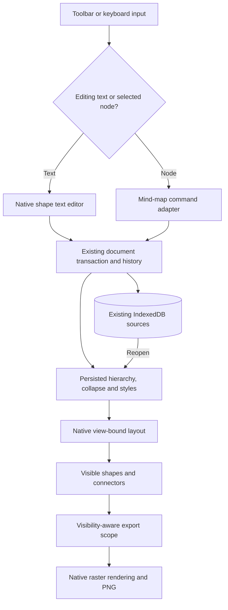

# Phase 2: Daily Mind Maps — Research

**Researched:** 2026-09-12
**Domain:** Native BlockSuite mind-map integration, local editing, layout, persistence and PNG regression
**Confidence:** MEDIUM — installed source inspected; Phase 2 browser behavior still requires execution evidence.

## User Constraints

The user authorized research and planning without a Phase 2 context document. Shortcut, layout, collapse and styling defaults below are proposals for the plans, not locked user decisions. This authorization was supplied by the planning orchestrator. [CITED: planning task instruction]

Use the approved Phase 2 scope and preserve Phase 1 functionality. The roadmap assigns hierarchical editing, collapse, automatic layout and styling to this phase; concurrent mind-map durability is allocated to Phase 5. [VERIFIED: .planning/ROADMAP.md:72-83; .planning/REQUIREMENTS.md:144-148]

<phase_requirements>
## Phase Requirements

DATA_4k9q7m2x_START

| ID | Approved description, verbatim | Research support |
|---|---|---|
| MIND-01 | Users can create and edit hierarchical mind maps and add child and sibling nodes through keyboard shortcuts. | Register native extensions; expose creation; preserve distinct selection and text-editing keymaps. |
| MIND-02 | Users can collapse and expand branches without deleting or changing their descendants. | Native collapse plus atomic history and conversion compatibility checks. |
| MIND-03 | Mind-map layout automatically adapts when nodes change or branches expand and collapse. | Register the native view-bound layout; verify layout after text sizing, hydration and history. |
| MIND-04 | Users can format node text and style mind-map branches. | Native map presets plus node-format preservation through relayout. |

DATA_4k9q7m2x_END

[VERIFIED: .planning/REQUIREMENTS.md:39-42]
</phase_requirements>

## Summary

Retain the installed BlockSuite foundation and activate its mind-map store/view extensions. The pinned source already implements hierarchical nodes, child/sibling commands, branch collapse controls, collapse-aware layout, and four map styles. The source exposes `MindmapViewExtension` and `MindmapStoreExtension`; Dali currently composes its primitive extensions explicitly. [VERIFIED: node_modules/@blocksuite/affine-gfx-mindmap/src/view.ts:17-35; node_modules/@blocksuite/affine-gfx-mindmap/src/store.ts:11-18; src/canvas/extensions.ts:88-145]

The integration must cover several exact seams: the model delegates layout to a method supplied by its view; collapse metadata can be dropped by specific conversion and direction-change paths; native relayout reapplies node styles; and Dali export scope expands grouped descendants before calculating bounds. These are concrete source observations, while their complete application-level consequences remain to be established by focused tests. [VERIFIED: node_modules/@blocksuite/affine-model/src/elements/mindmap/mindmap.ts:121-134,179-198,721-738; node_modules/@blocksuite/affine-gfx-mindmap/src/view/utils.ts:342-357; src/canvas/presentation-export.ts:106-157]

**Primary recommendation:** Add native mind maps with a narrow, version-guarded compatibility layer for state/history, layout lifecycle and formatting; retain the native layout algorithm and renderer. Prove these seams in the first implementation plan before broadening controls. [ASSUMED: proposed architecture, to be validated by the initial compatibility tests]

## Architectural Responsibility Map

The following assignments are proposed planning structure. [ASSUMED: architectural proposal]

| Capability | Primary tier | Secondary tier | Rationale |
|---|---|---|---|
| Creation, keyboard editing, selection | Browser/editor | React canvas chrome | Native editor owns focus, selection and text editing. |
| Hierarchy, style, collapse state | Document model | Browser-local persistence | Keep one document-backed representation compatible with later collaboration. |
| Visible layout and branch rendering | Browser/editor view | Document geometry | Native layout sizes visible subtrees around the root. |
| Reload and undo/redo | Existing store/history | IndexedDB | Extend the existing lifecycle and regression checks. |
| Export scopes and bounds | Existing PNG pipeline | Native canvas renderer | Filter visibility and connector membership before allocation and drawing. |

## Project Constraints (from AGENTS.md)

These actionable constraints are taken from the repository contributor instructions. [CITED: AGENTS.md]

- Keep repository content and publishable history organization-neutral; use synthetic examples and images.
- Keep private organization/product/customer information, real screenshots, identity data, host paths, secrets, tenant identifiers, production domains, deployment settings and operational evidence outside the repository. Personal Git attribution is allowed.
- Keep operator identity and deployment configuration exclusively in operator infrastructure; expose generic interfaces publicly.
- Apply the privacy boundary to plans, research caches, generated artifacts, logs, commits and PRs; review staged changes and outgoing history before publication. Never force-add private files. If history contains private material, stop publication and prepare reviewed remediation.
- Use GSD and read scope, requirements and roadmap. Deliver phases sequentially, research before planning, check plans before execution, and verify requirements afterward.
- Execute approved plans automatically; escalate blockers or consequential decisions. Parallel work requires explicit ownership within an approved phase.
- Follow project model/reasoning configuration. Verify static errors before commits and relevant checks before a PR. Keep PR descriptions concise.
- Preserve applicable DJAI Open Canvas notices. Respect the defined release capabilities; MCP creation and Plane integration remain deferred, and ClickUp imports remain excluded.

No implementation, branch changes or commits are authorized for this research subtask. [CITED: planning task instruction]

## Standard Stack

Reuse existing dependencies. No package installation or upgrade is proposed. Installed versions below came from local manifests and `npm ls`; a registry lookup failed with `ENOTFOUND registry.npmjs.org`, so latest versions and publication dates were not observed. [VERIFIED: package.json:30-51; local npm inspection, 2026-09-12]

DATA_v8p2d6n4_START

| Component | Existing version | Role |
|---|---|---|
| `@blocksuite/affine` | `0.22.4` | Public facade, native models, extensions and renderers |
| `react` | `18.3.1` installed; manifest `^18.3.1` | Existing toolbar/inspector integration |
| `typescript` | `5.9.3` installed; manifest `^5.6.3` | Static API contract checks |
| `vite` | `7.3.6` | Existing raw TypeScript/decorator build pipeline |
| `vitest` | `4.1.11` | Pure derived-state and export-scope tests |
| `@playwright/test` | `1.62.1` installed; manifest `^1.62.1` | Native interaction and PNG regression |

DATA_v8p2d6n4_END

[VERIFIED: package.json:30-51; local npm ls inspection, 2026-09-12]

Native mind-map store and view facades re-export the installed package. Match the existing explicit extension/optimizer composition when adding them. Current online BlockSuite API documentation also lists the mind-map renderer and interaction extensions, but its current surface includes additional entries; use the installed version for exact implementation signatures. [VERIFIED: node_modules/@blocksuite/affine/src/gfx/mindmap/store.ts:1; node_modules/@blocksuite/affine/src/gfx/mindmap/view.ts:1; src/canvas/extensions.ts:14-15; vite.config.ts:40-112] [CITED: https://blocksuite.io/api/%40blocksuite/affine-gfx-mindmap]

### Package Legitimacy Audit

No new external package is proposed, so an installation legitimacy gate is not applicable to this phase plan. Keep the existing lockfile. If implementation introduces a package, run the legitimacy, correct-registry and postinstall checks before installation. This research does not claim a fresh registry legitimacy verdict for existing dependencies. [CITED: research task package-legitimacy protocol]

## Architecture Patterns

### System architecture diagram

Proposed integration flow. [ASSUMED: architectural proposal]



### Native capability and compatibility map

1. **Creation and hierarchy:** the native creation basket constructs a root and three sample children, then creates the map through surface CRUD. The model creates ordinary shape nodes and stores parent/order details in its child map. Prefer one root placed at the current viewport center with its text editor focused; this smaller starting shape is a proposed UX default. [VERIFIED: node_modules/@blocksuite/affine-gfx-mindmap/src/toolbar/basket-elements.ts:59-100; node_modules/@blocksuite/affine-model/src/elements/mindmap/mindmap.ts:265-359,916-965] [ASSUMED: proposed root-only creation default]

2. **Layout binding:** the model's layout function calls its private delegate only if supplied. Native view creation installs that delegate through `setLayoutMethod`, which calls the existing layout utility. Register the view before expecting any layout, including restored maps. Avoid testing only the model in a Node environment and concluding layout works. [VERIFIED: node_modules/@blocksuite/affine-model/src/elements/mindmap/mindmap.ts:721-738,820-822; node_modules/@blocksuite/affine-gfx-mindmap/src/view/view.ts:119-145,344-348]

3. **Collapse-aware native layout exists:** size calculation and recursive placement explicitly stop at collapsed nodes. The model toggles descendant visibility, preserves nested collapsed branches on expansion and optionally schedules layout. The native button invokes that option. [VERIFIED: node_modules/@blocksuite/affine-gfx-mindmap/src/view/layout.ts:36-80,110-128; node_modules/@blocksuite/affine-model/src/elements/mindmap/mindmap.ts:856-890; node_modules/@blocksuite/affine-gfx-mindmap/src/view/view.ts:303-317]

4. **Persistent collapse:** the child detail definition includes the exact field `collapsed?: boolean;`; descendant visibility is defined as `@field(false)` / `accessor hidden: boolean = false;`. The decorator argument supplies a fallback, and its setter writes to the model Y.Map. Both are document state. Recommend board-persisted collapse with the same semantics carried into future collaboration. [VERIFIED: node_modules/@blocksuite/affine-model/src/elements/mindmap/mindmap.ts:31-38; node_modules/@blocksuite/std/src/gfx/model/surface/element-model.ts:358-359; node_modules/@blocksuite/std/src/gfx/model/surface/decorators/field.ts:18-21,52-77] [ASSUMED: proposed shared-state product default]

5. **Collapse preservation hazards:** the record-to-Y conversion uses a pick list containing only `'index'` and `'parent'`; the direction watcher replaces first-level detail records with only `index` and `parent`. Preserve collapse on the specific clipboard/duplication and layout-change paths that exercise these functions. Do not claim every save path loses collapse: direct Yjs persistence uses a different route. [VERIFIED: node_modules/@blocksuite/affine-model/src/elements/mindmap/mindmap.ts:121-134,179-198]

6. **Text formatting versus layout:** native style application writes every style property when different; normal layout calls it with content fitting enabled. Text editing itself invokes layout during resizing and on disposal. Thus a font or color set directly on the shape can be overwritten by the map preset. The selected mechanism is geometry/style separation using existing shape fields as authoritative text values, detailed under Resolved Planning Mechanisms below. Preserve the native geometric algorithm and existing document schema. [VERIFIED: node_modules/@blocksuite/affine-model/src/elements/mindmap/style.ts:501-508; node_modules/@blocksuite/affine-gfx-mindmap/src/view/utils.ts:138-167,342-357; node_modules/@blocksuite/affine-gfx-shape/src/text/edgeless-shape-text-editor.ts:136-147,174-217] [ASSUMED: selected compatibility design; runtime proof required]

### Proposed defaults for plans

The following defaults are proposals, based on the native source mappings, and are not locked user decisions. [ASSUMED: proposed interaction contract]

| Situation | Proposed behavior |
|---|---|
| Add mind map | Accessible left-rail control; one editable root at viewport center; select and focus root text. |
| Node selected, Tab | Append child, expand parent if needed, focus new text. |
| Node selected, Enter | Add next sibling; at root add a child. |
| Editing text, Enter | Commit and return to node selection; the next Enter adds a sibling. |
| Editing text, Shift+Enter | Multiline text; do not trigger node creation. |
| Editing text, Tab | Commit and exit text editing, matching native behavior. |
| IME composition | Preserve composition; do not dispatch tree commands. |
| Escape | Exit text editing or dismiss mind-map controls; ensure focus remains usable. |
| Layout | Right-facing default; offer native left and balanced layouts. Preserve root position. |
| Style | Native first preset by default; offer all four presets as map/branch styling, plus node font size, weight and text color that survive later edits. |
| Collapse indicator | Native direct-child count; accessible name explaining direct branches hidden; hide on leaves. |
| Collapse persistence | Store with board content and undo as a single user action. |
| PNG export | Export currently visible content; omit interaction controls/badges; explain that users can expand branches before exporting them. |

Native evidence for the keyboard rows is the selected-node keymap and shape editor. The shape editor checks composition for Enter, uses the literal `'Esc'` as well as Tab, and stops propagation. Test actual Escape behavior rather than assuming that literal handles browser Escape. [VERIFIED: node_modules/@blocksuite/affine-block-root/src/edgeless/edgeless-keyboard.ts:364-459; node_modules/@blocksuite/affine-gfx-shape/src/text/edgeless-shape-text-editor.ts:103-133]

Native layout/style values, verbatim: `BALANCE = 2`, `LEFT = 1`, `RIGHT = 0`; `FOUR = 4`, `ONE = 1`, `THREE = 3`, `TWO = 2`. Native defaults are `accessor layoutType: LayoutType = LayoutType.RIGHT;` and `accessor style: MindmapStyle = MindmapStyle.ONE;`. The badge uses `collapseButton.text = collapsed ? node.children.length.toString() : '';`. [VERIFIED: node_modules/@blocksuite/affine-model/src/consts/mindmap.ts:1-12; node_modules/@blocksuite/affine-model/src/elements/mindmap/mindmap.ts:967-973; node_modules/@blocksuite/affine-gfx-mindmap/src/view/view.ts:248-251]

### Component responsibilities

File names for new modules below are proposals; inspected existing files are source references, not instructions to change unrelated code. [ASSUMED: proposed file allocation]

| Component | Planned responsibility |
|---|---|
| Extension composition and Vite optimizer | Register native mind-map store/view; add exact facade imports to optimized dependencies. |
| Canvas toolbar | Create the map, focus editing, show brief keyboard help. |
| Proposed `src/canvas/mindmap.ts` | Resolve selected node; guard focus/locks; wrap native operations; preserve collapse/history and node styling. |
| Proposed `src/canvas/mindmap-compatibility.ts` | Bind lifecycle and preserve formatting while reusing native layout; dispose observers on teardown. |
| Proposed `src/canvas/mindmap-state.ts` | Pure effective visibility, tree integrity and export membership helpers, if needed. |
| Existing selection inspector | Expose relevant node formatting and accessible branch actions, with disabled state for inapplicable selection. |
| Existing PNG exporter | Filter hidden descendants before bounds, counts and raster; preserve selected-only exclusion. |

## Local Persistence, Undo and Export

The existing workspace injects IndexedDB document/blob sources, starts synchronization before initializing metadata, and retains the existing storage identifier. Keep those mechanisms. The existing canvas undo control calls the store, and initial blank-board creation resets history only after seeding the page/surface. New mind-map creation must be a normal undoable content operation. [VERIFIED: src/canvas/workspace.ts:104-136; src/canvas/runtime.ts:117-138; src/canvas/BlockSuiteCanvas.tsx:263-264]

Wrap collapse visibility changes and detail updates in one outer transaction with synchronous layout and explicit capture boundaries, as specified under Resolved Planning Mechanisms. After undo/redo, reopen, direction change and copy, assert both effective descendant visibility and metadata rather than checking the boolean alone. Native collapse writes descendant flags before its inner metadata transaction and optionally schedules layout in a microtask; the adapter must suppress that optional queue for the user command. [VERIFIED: node_modules/@blocksuite/affine-model/src/elements/mindmap/mindmap.ts:804-811,856-890] [ASSUMED: selected atomic-history adapter]

Native canvas rendering checks `(element.display ?? true) && !element.hidden`, and the mind-map connector renderer stops traversing children at a collapsed node. Dali's export planner, however, recursively adds group descendants and unites their bounds. Filter invisible content before export bounds/count/preflight calculation so collapsed work does not create unused export area. [VERIFIED: node_modules/@blocksuite/affine-block-surface/src/renderer/canvas-renderer.ts:295-305; node_modules/@blocksuite/affine-gfx-mindmap/src/element-renderer.ts:30-75; src/canvas/presentation-export.ts:52-65,106-157]

Selected-node export requires special care: branch connectors belong to the mind-map renderer, while nodes are separate shapes. Including a whole map renderer for one selected node can paint sibling connectors. Define selection export as explicitly selected visible objects plus their authorized group descendants, and render only connector edges whose endpoints are included. Add synthetic siblings outside the selected scope to prove exclusion. Keep the existing frame clip and allocation checks. [VERIFIED: node_modules/@blocksuite/affine-gfx-mindmap/src/element-renderer.ts:30-75; src/canvas/presentation-export.ts:116-140,210-227] [ASSUMED: proposed edge inclusion rule]

## Don't Hand-Roll

| Problem | Use | Reason and evidence |
|---|---|---|
| Tree layout and node spacing | Native view/layout algorithm | Already branches on collapsed detail and computes subtree sizes. [VERIFIED: node_modules/@blocksuite/affine-gfx-mindmap/src/view/layout.ts:36-128] |
| Hierarchical ordering | Native add-node and child map | Native insertion computes ordering and creates associated shapes. [VERIFIED: node_modules/@blocksuite/affine-model/src/elements/mindmap/mindmap.ts:265-359] |
| Rich text editor | Native shape text editor | Already integrated with sizing, selection and composition handling. [VERIFIED: node_modules/@blocksuite/affine-gfx-shape/src/text/edgeless-shape-text-editor.ts:103-147,174-225] |
| Storage and history | Existing workspace/store | Shares the canvas document lifecycle. [VERIFIED: src/canvas/workspace.ts:104-136; src/canvas/runtime.ts:117-138] |
| PNG rasterization | Existing guarded native pipeline | Preserves mixed-layer drawing and preflight checks. [VERIFIED: src/canvas/presentation-export.ts:147-157,210-227] |

## Common Pitfalls

- **Registering only models:** layout delegation is installed by the view. Verify both new and restored maps after mount. [VERIFIED: node_modules/@blocksuite/affine-model/src/elements/mindmap/mindmap.ts:721-738; node_modules/@blocksuite/affine-gfx-mindmap/src/view/view.ts:344-348]
- **Duplicate keyboard commands:** selected-node and inline-editing contexts already have different handlers. A global duplicate can add two nodes or interrupt text composition. Use a native-first adapter and assert one command produces exactly one new node. [VERIFIED: node_modules/@blocksuite/affine-block-root/src/edgeless/edgeless-keyboard.ts:364-459; node_modules/@blocksuite/affine-gfx-shape/src/text/edgeless-shape-text-editor.ts:103-133] [ASSUMED: integration failure mode]
- **Collapse metadata and hidden flags diverge:** direction changes and conversion rewrite details; test the actual invoked copy and persistence routes. [VERIFIED: node_modules/@blocksuite/affine-model/src/elements/mindmap/mindmap.ts:121-134,179-198,856-890]
- **Formatting disappears:** native style application rewrites shape properties during layout. A passing style-click screenshot is insufficient; add a sibling, edit multiline content, collapse, expand and reload afterward. [VERIFIED: node_modules/@blocksuite/affine-model/src/elements/mindmap/style.ts:501-508; node_modules/@blocksuite/affine-gfx-mindmap/src/view/utils.ts:342-357]
- **Canvas badge mistaken for content:** collapse buttons are local shapes and count direct children. Keep accessible controls in chrome and deliberately specify export behavior. [VERIFIED: node_modules/@blocksuite/affine-gfx-mindmap/src/view/view.ts:208-251]
- **Malformed imported hierarchy:** validate parent existence, one root, duplicate IDs and cycles at any new adapter boundary. Use bounded traversal with visited IDs for derived scope and counts. [ASSUMED: proposed defensive implementation]

## Code Examples

Exact native operation signatures and fields were read in the installed source. These snippets illustrate calls within an already mounted native view; the planner must add transaction/focus guards around them. Values used below are quoted here verbatim: `position: 'before' | 'after' = 'after'`, `toggleCollapse(node: MindmapNode, options: { layout?: boolean } = {})`, and `setLayoutMethod(layoutMethod: MindmapElementModel['layout'])`. [VERIFIED: node_modules/@blocksuite/affine-model/src/elements/mindmap/mindmap.ts:265-273,820-822,856-861]

```ts
// Existing mounted MindmapElementModel; node IDs come from native selection.
const childId = mindmap.addNode(node.id);
const parent = mindmap.getParentNode(node.id) ?? node;
const siblingId = mindmap.addNode(parent.id, node.id, 'after');
mindmap.toggleCollapse(node, { layout: true });
```

The native selected-node keymap uses these same child and sibling operations. [VERIFIED: node_modules/@blocksuite/affine-block-root/src/edgeless/edgeless-keyboard.ts:405-445]

Proposed visibility derivation for export and state checking; this is pseudocode, not a claimed native API. [ASSUMED: proposed algorithm]

```text
walk(node, ancestorCollapsed):
  effectiveHidden = ancestorCollapsed
  record node ID, effectiveHidden
  for each child:
    walk(child, ancestorCollapsed OR node.collapsed)
```

## State of the Art

The installed release exports raw TypeScript sources; the existing Vite configuration explicitly lowers decorators and groups dependency optimization. Preserve that pipeline and add mind-map facade entries consistently. Current online API documentation is useful for orientation, but the installed source is the version-specific contract. [VERIFIED: node_modules/@blocksuite/affine-gfx-mindmap/package.json:42-45; vite.config.ts:9-40,113-147] [CITED: https://blocksuite.io/api/%40blocksuite/affine-gfx-mindmap]

## Environment Availability

| Dependency | Observation | Execution consequence |
|---|---|---|
| Node / npm | Available: `v26.7.0` / `11.19.0` from CLI probes | Existing tooling can be invoked. [VERIFIED: local environment probe, 2026-09-12] |
| Installed canvas/test stack | Present; versions recorded above | No dependency installation proposed. [VERIFIED: local npm ls inspection, 2026-09-12] |
| Registry network | Version lookup failed: `ENOTFOUND registry.npmjs.org` | Publication date/current registry version unknown; use pinned installed source. [VERIFIED: npm view failure, 2026-09-12] |
| Context7 / ctx7 CLI | No callable tool found; CLI lookup returned no executable | Used primary-source web search and installed package source. [VERIFIED: tool discovery and command lookup, 2026-09-12] |
| Browser binaries | Phase 1 reports browser execution; this research did not launch browsers | First plan must establish the native mind-map smoke test. [CITED: .planning/phases/01-editable-canvas-and-image-portability/01-VERIFICATION.md] |

## Validation Architecture

Project validation is enabled by `"nyquist_validation": true`. Existing scripts are `"test": "vitest run"`, `"typecheck": "tsc --noEmit"`, and `"test:browser": "playwright test"`. The browser configuration runs `dev`, `prod`, `prod-firefox`, and `prod-webkit`; the common fixture fails unexpected console/page errors. [VERIFIED: .planning/config.json:32-38; package.json:25-28; playwright.config.ts:16-20; tests/fixtures.ts:21-38]

### Test framework and commands

| Check | Proposed command |
|---|---|
| Fast unit selection/state tests | `npm test -- src/canvas/mindmap-state.test.ts` |
| Targeted native smoke | `npm run test:browser -- tests/mindmap.spec.ts --project=prod --grep "keyboard child"` |
| Phase browser tests | `npm run test:browser -- tests/mindmap.spec.ts` |
| Static/build | `npm run typecheck && npm run build` |
| Phase gate | `npm test && npm run test:browser` |

New test filenames are proposed Wave 0 artifacts. Target a warm-server smoke test under 30 seconds; initial server/build startup is additional and must be reported separately. Do not claim that timing before measuring it. [ASSUMED: proposed validation commands and timing target]

### Phase requirements → test map

| Requirement | Behavior/oracle | Type | Planned test |
|---|---|---|---|
| MIND-01 | Create through UI; one child/sibling per shortcut; root fallback; text editing versus selected mode; multiline, IME, Escape and toolbar focus | Browser | New mind-map suite |
| MIND-02 | Nested collapse preserves IDs, text, parents and order; expand reveals correct descendants; one undo/redo restores state; reopen preserves flags and visibility | Browser + pure visibility unit | New mind-map suite/state unit |
| MIND-03 | Text growth, child addition, deletion, collapse and expand change visible geometry without overlap; root anchor stable; each direction tested | Browser geometry assertions | New mind-map suite |
| MIND-04 | Font size/weight/color survive additions, text edits, collapse, reload and undo; native preset changes connectors while preserving hierarchy | Browser + rendered image | New mind-map suite |
| Carry-forward | Collapsed/expanded board, frame and selection PNGs at supported scales; siblings outside selection absent; image/text regression; copy remains independent | Browser/export pixel assertions | Extend export and mind-map suites |

This is a proposed test allocation, not executed test evidence. Start with a seven-node synthetic nested fixture, including a nested collapsed branch and a long multiline label. Add a bounded 50-node layout stress fixture without declaring it a production performance guarantee. [ASSUMED: proposed validation fixtures]

### Sampling and Wave 0 gaps

- Per task: targeted tests plus typecheck for changed APIs.
- Per wave: all mind-map cases plus affected Phase 1 export/arrangement cases.
- Before phase completion: full unit/browser suite and build, with visible inspection of synthetic PNGs and keyboard-only operation.
- Create the focused native compatibility smoke first: registration, one root, child, sibling, collapse, undo, reload and export. Capture failing behavior before compatibility changes.
- Add pure tests only for independently meaningful state/scope algorithms. Exercise native editor semantics in a browser.
- All new mind-map tests and adapters are Wave 0 gaps; no Phase 2 implementation or tests were created by this research.

[ASSUMED: proposed validation schedule]

## Security Domain

Use ASVS 5 category names explicitly. The official index lists V1 Encoding and Sanitization, V2 Validation and Business Logic, V3 Web Frontend Security, V5 File Handling, V6 Authentication, V7 Session Management, V8 Authorization and V11 Cryptography. Older category numbers must not be mixed with these names. [CITED: https://cheatsheetseries.owasp.org/IndexASVS.html]

| Category | Phase applicability | Planned control |
|---|---|---|
| V1 / V3 | Node labels and editor controls | Treat labels as text, preserve native rich-text encoding, never inject arbitrary label HTML. |
| V2 | Tree mutations and derived traversals | Validate parent membership, cycle prevention, finite geometry and bounded traversal; protect editor responsiveness. |
| V5 | Existing image export and copy/import routes | Preserve export resource limits and include only selected/visible content. |
| V6 / V7 / V8 | Access delivery belongs to later approved phases | Keep native locked/read-only checks; avoid introducing separate permission semantics in mind-map helpers. |
| V11 | No new cryptographic capability proposed | Reuse existing browser/storage mechanisms; add no custom cryptography. |

Applicability and mitigations are planning recommendations. [ASSUMED: phase threat assessment]

Threat tests: synthetic markup-like labels must render as text; malformed parent/cycle inputs must fail without partial mutation; hidden/sibling content must be absent from selected PNG output; long labels and repeated branch toggles must leave the editor responsive. Preserve generic synthetic artifacts under the public privacy boundary. [ASSUMED: proposed threat tests]

## Assumptions Log

| ID | Proposal / unverified claim | Sections | Risk if wrong |
|---|---|---|---|
| A1 | Native-first compatibility adapter is sufficient without replacing layout | Summary, Architecture | Additional extension work may be needed after first smoke test. |
| A2 | Right-facing root-only creation, direct-child badge, native keymap and persistent/shared collapse satisfy daily workflow | Defaults | Plans must make these reviewable defaults; revise if user chooses otherwise. |
| A3 | Selected existing-field style/geometry adapter preserves node text properties | Resolved Planning Mechanisms | Runtime tests may reveal a missing interception path; fix within selected existing-field design. |
| A4 | Synchronous command layout plus outer transactions and capture boundaries yields one undo action | Persistence | Undo grouping needs targeted native evidence; queued geometry writes must be eliminated. |
| A5 | Visibility/edge filtering yields correct selection export without unrelated connectors | Export | Renderer integration needs pixel and membership checks. |
| A6 | Proposed files, test timing, fixture sizes, sampling and security controls | Architecture, Validation, Security | These are execution design choices and measured targets, not achieved guarantees. |

## Resolved Planning Mechanisms

These are selected implementation designs supported by the source traces below. They supersede earlier research alternatives. Runtime tests must prove them; execution does not choose a competing architecture. [ASSUMED: selected plan design]

### 1. Existing text fields are authoritative; geometry-only routine layout

Treat the existing shape properties `fontSize`, `fontWeight`, and `color` as authoritative for every existing node. Do not infer whether their values originally came from a preset or a user action. Consequently map preset changes preserve these text properties on all existing nodes, while new nodes receive native initial defaults. These field names occur verbatim in native node styling, and native addNode spreads its calculated node style at creation. [VERIFIED: node_modules/@blocksuite/affine-model/src/elements/mindmap/style.ts:39-42; node_modules/@blocksuite/affine-model/src/elements/mindmap/mindmap.ts:303-317]

Install a scoped per-model layout wrapper before the first view-bound layout call, retaining the native delegate supplied through setLayoutMethod. Routine calls fit node text using final current text properties, then call the retained native delegate with `applyStyle: false`. Explicit preset changes snapshot those three properties for all existing nodes, invoke native preset application, restore the properties, fit text again, and perform geometry-only layout synchronously. Preserve hydrated/copied fields on first mount; initialize a newly created root through native addNode/root styling rather than relying on a mount-time reset. No new override fields, side store or migration is selected. The wrapper must handle native style-watch calls through the same preservation sequence and be disposed/restored with its view. [ASSUMED: selected adapter implementation] [VERIFIED: node_modules/@blocksuite/affine-model/src/elements/mindmap/mindmap.ts:137-139,342-359,721-738,820-822; node_modules/@blocksuite/affine-gfx-mindmap/src/view/view.ts:119-145; node_modules/@blocksuite/affine-gfx-mindmap/src/view/utils.ts:138-167,342-357]

Validation asserts additions, edits, multiline fitting, direction changes, presets, copy, undo and reload retain the three values and keep visible bounds non-overlapping. These tests prove the chosen mechanism; they do not authorize changing persisted representation. [ASSUMED: selected validation]

### 2. Actual copy paths: reuse the native routes without speculative conversion patches

Canvas duplication goes from Dali's duplicateCanvasSelection to native duplicate, which uses getSortedCloneElements, prepareCloneData and createElementsFromClipboardDataCommand. Primitive serialization calls element.serialize. The clipboard creation function has a dedicated mind-map branch that spreads the complete child detail, remaps child and parent IDs, and assigns a Y.Map before CRUD insertion. Therefore this route bypasses the lossy plain-record pick list in propsToY. The native clipboard paste handler calls that same creation command. Preserve these paths and test them rather than patching propsToY speculatively. [VERIFIED: src/canvas/arrangement.ts:36-48; node_modules/@blocksuite/affine-block-root/src/edgeless/utils/clipboard-utils.ts:29-62; node_modules/@blocksuite/affine-block-root/src/edgeless/utils/clone-utils.ts:27-65; node_modules/@blocksuite/affine-block-root/src/edgeless/clipboard/canvas.ts:40-69; node_modules/@blocksuite/affine-block-root/src/edgeless/clipboard/clipboard.ts:591-605]

Whole-map copying includes descendant elements through getSortedCloneElements, including their persisted hidden state. A selected ordinary topic shape alone follows the native shape copy route and becomes an independent shape; do not silently promise subtree copying for that selection. Offer/select the entire map for hierarchy-preserving duplication. [VERIFIED: node_modules/@blocksuite/affine-block-root/src/edgeless/utils/clone-utils.ts:27-38,51-65] [ASSUMED: selected topic-copy UX boundary]

Board duplication uses docToSnapshot followed by structuredClone and snapshotToDoc with replaceIdMiddleware. Retain that exact flow. The middleware remaps document/block identifiers and selected references; its surface pass handles connectors/groups while canvas element records retain their document-scoped IDs. Do not add global canvas-ID remapping or a migration merely because the middleware has no mind-map case. Validate independence by editing the duplicate document and comparing source hierarchy/content. Board backup uses ZipTransformer export/import and also receives a round-trip regression. [VERIFIED: src/boards/operations.ts:150-165; node_modules/@blocksuite/affine-shared/src/adapters/middlewares/replace-id.ts:129-169,182-244; src/canvas/export-board.ts:140-150; src/canvas/BlockSuiteCanvas.tsx:159] [ASSUMED: selected copy validation]

### 3. Synchronous atomic command/history boundary

Use captureSync before the command, one outer store.transact for detail, hidden and geometry writes, then captureSync after completion. For collapse call the native toggle with `layout: false`, followed immediately by the retained geometry-preserving layout delegate within the same transaction. Route native collapse-button calls through the scoped model wrapper so native `{layout:true}` cannot enqueue a trailing write outside the boundary. During a structural command, intercept requestLayout into a synchronous/coalesced command-local dirty flag; flush once before closing the outer transaction. Delayed text measurement starts its own coherent text-edit update and must not append stale writes after a completed structural action. [ASSUMED: selected scheduling design]

The source defines captureSync as undoManager.stopCapturing, and requestLayout as a queueMicrotask callback. Store.transact catches errors and logs them rather than rolling back. Prevalidate first, snapshot only fields touched by the command, and explicitly restore on a detected failure inside the command wrapper before its transaction closes; inspect result validity instead of relying on an exception escaping store.transact. Never use withoutTransact for a user's structural mutation. [VERIFIED: node_modules/@blocksuite/store/src/model/store/store.ts:371-405,407-425; node_modules/@blocksuite/affine-model/src/elements/mindmap/mindmap.ts:804-811,856-890] [ASSUMED: selected failure handling]

Direction changes also use this command boundary: snapshot all child details, perform the native direction change, restore existing collapsed values by ID while retaining current parent/order fields, reconcile effective visibility and synchronously lay out. Reconcile after hydration/history as derived-state repair only when necessary, and avoid producing a new user undo entry from history playback. [ASSUMED: selected direction/history reconciliation] [VERIFIED: node_modules/@blocksuite/affine-model/src/elements/mindmap/mindmap.ts:121-134]

### 4. Exact export membership and renderer mechanism

Select these rules: whole-board export includes all visible map nodes; selecting a map container includes its visible descendants; selecting one topic exports that topic alone; selecting multiple topics exports exactly those visible topics. Include a native edge only when both endpoint node IDs are included. Frame mode additionally clips at the existing frame boundary. Omit local collapse buttons and the short collapsed-tail affordance. Retain unrelated objects' existing scope rules. [ASSUMED: selected export policy]

For every map intersecting scope, build one visible node-ID set and eligible native edge list. Exclude the map's aggregate renderer from the ordinary canvas-element list, because it recursively paints the map. At the map's original layer slot render each eligible connector using the existing native connector renderer and path generator with the same transform, scale, opacity and bounds conventions as the native map renderer. Render node shapes at their original ordinary layers. Native getConnectors returns edges with source/target IDs for real children, while collapsed tails have an absolute target position; the endpoint-ID rule naturally excludes tails. Never mutate the live tree to hide unwanted export edges. Calculate bounds from eligible visible node/edge geometry before preflight allocation. [ASSUMED: selected renderer integration] [VERIFIED: node_modules/@blocksuite/affine-model/src/elements/mindmap/mindmap.ts:491-578; node_modules/@blocksuite/affine-gfx-mindmap/src/element-renderer.ts:23-75; src/canvas/presentation-export.ts:106-157,210-227]

## Open Questions

No architecture selection remains open for these four mechanisms. Runtime compatibility is unverified: tests must establish interceptor ordering, native text fitting, copy independence, history grouping and export pixels. A failure is a concrete implementation defect against the selected design; report evidence if it prevents that design rather than silently introducing a new data model or migration. [ASSUMED: selected execution boundary]

## Sources

- BlockSuite official API index ([https://blocksuite.io/api/%40blocksuite/affine-gfx-mindmap](https://blocksuite.io/api/%40blocksuite/affine-gfx-mindmap)) — source discovery and current extension orientation. Search retrieved content; direct page fetch timed out. Exact release behavior comes from installed source references above.
- OWASP Cheat Sheet Series, ASVS index ([https://cheatsheetseries.owasp.org/IndexASVS.html](https://cheatsheetseries.owasp.org/IndexASVS.html)) — verified current category mapping.
- Installed BlockSuite source files, each cited beside the finding with line ranges — model, view, layout, decorators, styles, renderer and keyboard handlers.
- Dali scope, requirements, roadmap, configuration, runtime, workspace, extension composition, exporter and test fixtures — repository behavior and approved delivery allocation.
- Phase 1 research and verification artifacts — historical integration and regression context; no Phase 1 test reruns performed for this research.

## Metadata

Research-plan seam selected Context7 for library docs and websearch for ASVS. Context7 and its CLI were unavailable, so the documented fallback used primary-source web search. The confidence seam returned MEDIUM for verified websearch and LOW for unrecognized local-source provider labels; exact local source findings above retain checkable provenance, while application behavior and proposed adaptations remain unproven until execution. No runtime success is inferred from source inspection. Cache digests contain generic technical findings only.

**Confidence:** source/API inventory MEDIUM; architecture MEDIUM with explicit assumptions; runtime readiness unverified.
**Research date:** 2026-09-12. **Refresh trigger:** any BlockSuite upgrade or change to export/history integration.
**Commit:** intentionally not performed under the research task's no-commit instruction.
