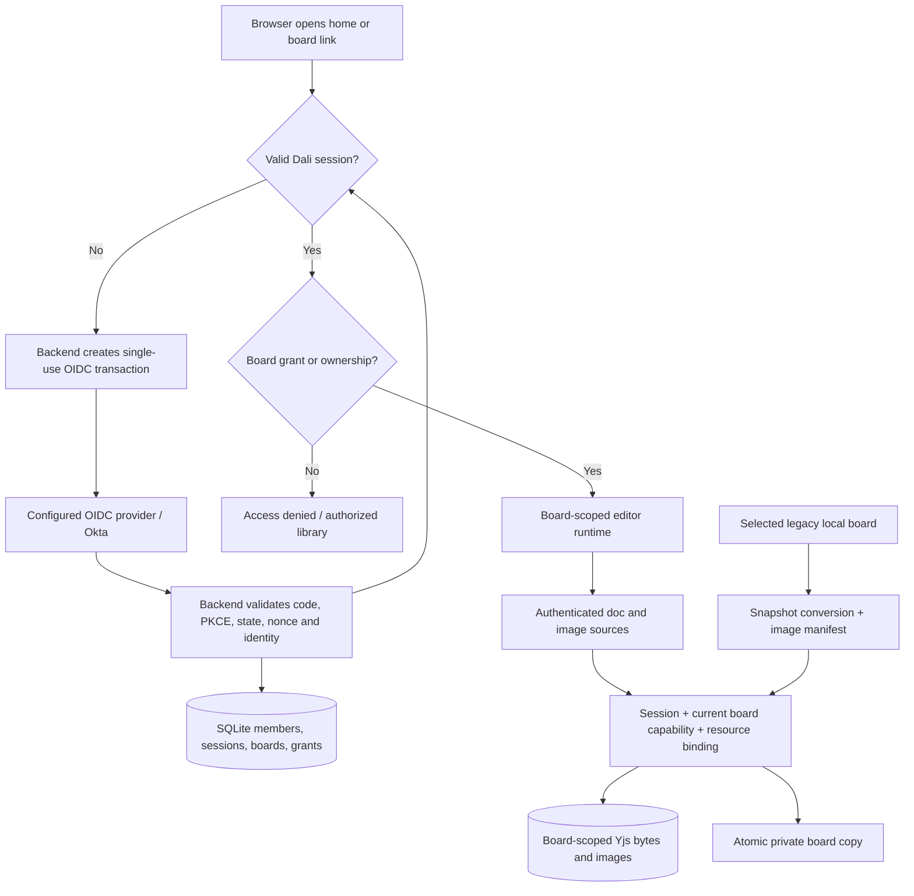

# Phase 3: Okta and Board Access - Research

**Researched:** 2026-09-16
**Domain:** OIDC server sessions, per-board authorization, BlockSuite storage adapters
**Confidence:** MEDIUM — official protocol documentation and pinned source inspected; proposed composition still requires its implementation tracer.

<user_constraints>
## User Constraints (from CONTEXT.md)

The following decision and discretion text is copied verbatim from the approved phase context. [VERIFIED: .planning/phases/03-okta-and-board-access/03-CONTEXT.md, implementation decisions]

<!-- DATA_6rA8mT2v_START -->
## Implementation Decisions

### Sign-in and sessions — explicit user selections

- **D-01:** Redirect signed-out users directly to Okta. Preserve a requested board target through authentication and open it when authorized. Entry without a board target lands in the board library; an unauthorized target uses the access-denied state in D-13.
- **D-02:** When a session expires during editing, pause editing, preserve pending work, and show “Session expired — sign in to continue.” Resume the same board after authentication. Recovery must recheck both identity and board access before applying pending changes.
- **D-03:** Explicit sign-out ends the Dalí session only. Show a signed-out page with “Sign in again”; this page does not immediately trigger automatic login.
- **D-04:** Keep users signed in across browser restarts until the operator-configured session expiry. Exact lifetime and renewal mechanisms belong to research and deployment configuration.

### Sharing defaults — explicit user selections

- **D-05:** New boards are private to their creator. Owners can share afterward.
- **D-06:** Owners can search existing internal members or enter an internal email before that person's first sign-in. Such a pending grant becomes usable only after a valid internal SSO identity is established. Owners can revoke pending grants as well as active grants. Email-to-identity matching requires validation during research.
- **D-07:** A new grant defaults to Viewer; the owner can explicitly choose Editor.
- **D-08:** Links convey a board location, while access requires an explicit grant or ownership. Sharing a link alone never grants access.

### Role capabilities

- **D-09 — explicit selection:** Viewers may export PNG and PDF. Editable board downloads require Owner or Editor.
- **D-10 — explicit selection:** Only owners and editors may duplicate a board. The copy is private, owned by its creator, and receives no inherited sharing grants.
- **D-11 — recommended option accepted through delegation:** Owners and editors may rename boards.
- **D-12 — delegated default:** Only owners may delete boards. Require confirmation that identifies the board. Granting, changing or revoking another member's access remains owner-only under BOARD-03.

| Action | Owner | Editor | Viewer |
|--------|-------|--------|--------|
| View and navigate the board | Yes | Yes | Yes |
| Modify canvas content and rename | Yes | Yes | No |
| Export PNG or PDF | Yes | Yes | Yes |
| Download editable board or duplicate | Yes | Yes | No |
| Manage sharing or delete the source board | Yes | No | No |

### Board home and existing work — recommended defaults under delegation

- **D-13:** Opening Dalí without a board target shows the authenticated board library. Explicit board links resume their target after sign-in and authorization. An inaccessible target shows a clear access-denied state with a route back to the library.
- **D-14:** Reuse the existing board-card layout, ordered by most recently updated. Provide All, Mine and Shared with me filters. Every accessible card shows private/shared status and the current member's Owner, Editor or Viewer role.
- **D-15:** Preserve the user-directed File > New behavior that opens a fresh board in another browser tab, and preserve the editable board title in the header. Creation establishes the creator as owner with private access; “Untitled board” remains a usable starting name.
- **D-16:** Offer explicit import/copy of selected browser-local boards into the signed-in account as private boards. Preserve the original local documents and images until the user deliberately removes them. Preserve titles and canvas content in the copies, and keep local work visibly distinct from account boards until imported. Account-bound caches and pending work must remain isolated across identities.

### Delegation and implementation discretion

The user answered D-01 through D-10 individually, then instructed: “move forward with recommended options.” D-11 uses the already-presented recommendation; D-12 through D-16 apply recommended defaults under that instruction. These defaults are planning inputs with recorded provenance, rather than separately answered questions.

Research and planning choose the backend, OIDC library, session storage, claims mapping, permission model representation, local-to-account copy mechanism, error text and routine styling. Respect the outcomes above. Validate preservation of pending edits through authentication interruptions, denial of writes after lost access, trusted matching of pending email grants, account/cache isolation, and coverage of native editor mutation paths. UI visibility must agree with authorization on direct document, image and mutation requests.

The phase's public checks use separate synthetic owner/editor/viewer/non-member contexts. Actual Okta integration validation remains a separately identified operator task. Local browser persistence and hidden UI controls alone do not establish the approved authenticated-access requirements.
<!-- DATA_6rA8mT2v_END -->

### Deferred Ideas (OUT OF SCOPE)

<!-- DATA_n9W4kP7s_START -->
## Deferred Ideas

No new deferred feature ideas were introduced. Durable operations and shared collaboration retain their Phase 4 and Phase 5 allocation; later facilitation, templates, diagrams and integrations retain the approved roadmap sequence.
<!-- DATA_n9W4kP7s_END -->
</user_constraints>

## Project Constraints (from AGENTS.md)

[VERIFIED: AGENTS.md, public repository boundary, workflow, product boundaries] Apply all of the following to the implementation plans:

- Keep repository content and publishable history organization-neutral, including planning, caches, logs, fixtures, commits and PRs.
- Keep organizational information, real screenshots, private user/customer/product data, host paths, credentials, tenant identifiers, production domains, deployment settings and operational evidence outside the repository.
- Personal Git attribution is allowed. Operator identity configuration and deployment settings live exclusively in operator-controlled infrastructure; public interfaces and examples stay generic/synthetic.
- Preserve applicable upstream notices. Review staged changes and outgoing history before publication; stop publication if private history is discovered and prepare remediation.
- Use GSD; read scope, requirements and roadmap; deliver phases sequentially; research before planning, check before execution, verify after each phase.
- Execute within approved plans; pause for blockers/consequential decisions; parallel independent tasks need explicit ownership; follow configured model/reasoning settings.
- Check static errors before commits, complete relevant checks before PR requests, keep PR descriptions concise.
- Preserve initial-release product scope. Roadmaps use ordinary objects; MCP and Plane stay deferred; ClickUp imports stay excluded.

No project skill directories or knowledge graph were returned by the explicit filesystem discovery. The agent-skills query returned the researcher role instructions rather than an additional skill mapping. [VERIFIED: session filesystem discovery and agent-skills command]

<phase_requirements>
## Phase Requirements

Descriptions below reproduce the acceptance requirements. [VERIFIED: .planning/REQUIREMENTS.md:13-17]

| ID | Description | Research Support |
|---|---|---|
| AUTH-01 | Members can sign in through configurable OIDC SSO with Okta compatibility and sign out of Dali. | Server OIDC callback, persistent opaque session, local logout, synthetic provider tests and separate operator validation |
| BOARD-01 | Members can create named boards and reopen boards they are authorized to access from a home view. | SQL board repository, authenticated home, scoped runtime and explicit legacy copy |
| BOARD-02 | The home view identifies private and shared boards and the member's role on each board. | Server-derived summaries, explicit role, owner/grant-based sharing state |
| BOARD-03 | Board owners can grant and revoke editor or viewer access for internal members. | Owner-only transactional grants; trusted pending-email activation |
| BOARD-04 | Editors can modify board content, viewers can view it, and members without access cannot retrieve board content or its images. | Per-request board/doc/blob authorization, native readonly coverage and direct-request adversarial suite |
</phase_requirements>

## Summary

**Recommendation:** add one same-origin Node/Fastify backend with SQLite, OIDC Authorization Code plus PKCE through openid-client, and database-backed opaque sessions. Keep identity/ACL/catalog state in SQL and use board-scoped Yjs document and image endpoints. This is a proposed implementation within the delegated discretion, rather than an existing system. Its security boundary follows trusted-service authorization guidance. [CITED: https://github.com/OWASP/ASVS/blob/master/5.0/en/0x17-V8-Authorization.md]

The pinned workspace reference synchronizes a root document and its subdocuments, and image sources accept only a blob key. Therefore use a separate account runtime for each board, with both source adapters bound to that board. Implement the public Workspace/Doc/WorkspaceMeta contracts; retain the existing TestWorkspace only behind the legacy-local import adapter. Concrete source evidence and the first required tracer follow below. [VERIFIED: node_modules/@blocksuite/store/src/test/test-workspace.ts:87-107; node_modules/@blocksuite/sync/src/doc/peer.ts:243-268; node_modules/@blocksuite/sync/src/blob/source.ts:12-18]

Phase 3 must demonstrate real reads/writes and denials through the backend. Restart recovery, backup/restore, deployment acceptance, real-time fanout and 20-user performance remain later-phase acceptance. Runtime expiry recovery still must preserve queued work and reauthorize before resubmission in this phase. [VERIFIED: .planning/ROADMAP.md:129-165; .planning/phases/03-okta-and-board-access/03-CONTEXT.md, D-02 and phase boundary]

## Architectural Responsibility Map

This table is the recommended responsibility split, derived from the approved decisions.

| Capability | Primary tier | Secondary tier | Rationale |
|---|---|---|---|
| OIDC, trusted identity, session expiry | Backend | Okta/OIDC provider | Validate protocol on trusted service; expose a minimal session descriptor |
| Board roles, grants and pending activation | Backend | SQL | One authority for every route and future transport |
| Board home summaries | Backend | React | SQL filters authorized rows; React renders cards |
| Canvas/native readonly | Browser | Backend | Interaction guards improve UX; server guards protect data |
| Documents and image bytes | Backend storage | Board-bound browser sources | Composite board/document/blob authorization |
| Pending editing recovery | Browser outbox | Backend | Persist before redirect; replay only after identity and role checks |
| Legacy import | Browser converter | Backend staging transaction | Preserve originals and atomically publish a private copy |
| Static shell | Vite/static hosting | Backend routing | Same-origin API/auth; no credentialed cross-origin API needed |

## Standard Stack

Recommended versions are exact execution pins, with registry observations from 2026-09-16. Latest-version age is a gate heuristic, not evidence of maliciousness. No dependency was installed during research.

| Library | Pin / publish date | Purpose / provenance |
|---|---|---|
| Existing React, Vite, BlockSuite | Preserve current lockfile; BlockSuite `"0.22.4"` | Existing frontend. [VERIFIED: package.json:30-59, literal `"@blocksuite/store": "0.22.4"`] |
| fastify | 5.12.5 / 2026-09-16 | Routes, hooks, JSON Schema, in-process request testing. [CITED: https://github.com/fastify/fastify] [WARNING: flagged as suspicious — verify before using.] |
| @fastify/cookie | 11.1.2 / 2026-07-15 | Cookie integration. [VERIFIED: npm registry; official https://github.com/fastify/fastify-cookie; gate OK] |
| @fastify/session | 11.1.3 / 2026-09-14 | Server-side session lifecycle with SQLite store adapter. [CITED: https://github.com/fastify/session] [WARNING: flagged as suspicious — verify before using.] |
| openid-client | 6.8.8 / 2026-09-05 | Discovery, code exchange, PKCE, nonce/state, UserInfo validation. [CITED: https://github.com/panva/openid-client] [WARNING: flagged as suspicious — verify before using.] |
| better-sqlite3 | 13.0.3 / 2026-08-05 | Prepared statements and synchronous transactions. [VERIFIED: npm registry; official https://github.com/WiseLibs/better-sqlite3; gate OK] |
| yjs | 13.6.31 / 2026-05-28 | Declare existing resolved version directly; avoid a canvas upgrade in this phase. Latest observed is 13.6.32. [VERIFIED: node_modules/yjs/package.json:2-3, `"name": "yjs"`, `"version": "13.6.31"`] [CITED: https://github.com/yjs/yjs] |
| rxjs | 7.8.2 / 2025-02-22 | Existing Subject dependency for public Workspace contracts. [VERIFIED: npm registry; official https://rxjs.dev/guide/installation; gate OK] |
| y-protocols | 1.0.7 / 2025-12-16 | Existing awareness class needed by AwarenessStore; keep network awareness disabled in this phase. [CITED: https://www.npmjs.com/package/y-protocols] |
| @types/better-sqlite3 | 9.6.0 / 2026-08-01 | SQL adapter types; verify API used against installed driver. [VERIFIED: npm registry; official https://github.com/DefinitelyTyped/DefinitelyTyped/blob/master/types/better-sqlite3/index.d.ts; gate OK] |

**Execution installation proposal, after package preflight:** pin the six new runtime packages plus existing Yjs/RxJS/protocol direct dependencies with `npm install --save-exact`; add SQL types with `npm install --save-dev --save-exact`. Retain existing Vitest/Playwright, using a separate server test config. Server TypeScript should compile with its own Node-targeted configuration and run emitted ESM; do not introduce another runtime loader solely for this phase.

**Alternatives considered:** PostgreSQL is a reasonable multi-instance future repository adapter, but adds a service dependency to this bounded acceptance. A SPA token architecture still needs the same board/backend authorization and complicates browser token lifecycle. SQLite plus server sessions directly exercises the required boundary. These are design recommendations; hosting and load suitability remain later validation.

## Package Legitimacy Audit

[VERIFIED: session package-legitimacy and npm metadata commands] The first sandboxed checks had unavailable network metadata. Repeated authorized read-only registry checks returned the following real observations. Age is approximate latest-release age at research time, not package age.

| Package | Registry | Release age | Weekly downloads | Official source repo | Verdict | Disposition |
|---|---|---:|---:|---|---|---|
| fastify | npm | <1 day | 9,518,055 | https://github.com/fastify/fastify | SUS: too-new | Retain current pin; pre-install verification checkpoint |
| @fastify/cookie | npm | 63 days | 2,071,485 | https://github.com/fastify/fastify-cookie | OK | Approved |
| @fastify/session | npm | 2 days | 142,565 | https://github.com/fastify/session | SUS: too-new | Retain current pin; pre-install verification checkpoint |
| openid-client | npm | 11 days | 9,808,529 | https://github.com/panva/openid-client | SUS: too-new | Retain current pin; pre-install verification checkpoint |
| better-sqlite3 | npm | 42 days | 7,725,408 | https://github.com/WiseLibs/better-sqlite3 | OK | Approved; native load smoke required |
| yjs | npm | 43 days (latest) | 6,453,316 | https://github.com/yjs/yjs | OK | Keep existing 13.6.31; recheck exact pin at install |
| rxjs | npm | >1 year | 73,955,900 | https://github.com/ReactiveX/rxjs | OK | Direct declaration of existing version |
| y-protocols | npm | 9 months | 3,357,112 | https://github.com/yjs/y-protocols | OK | Preserve 1.0.7; do not follow current main's renamed package |
| @types/better-sqlite3 | npm | 46 days | 3,457,423 | https://github.com/DefinitelyTyped/DefinitelyTyped | OK | Approved |

No SLOP packages. Registry postinstall fields were absent for all listed packages; this is an observed metadata result, not a guarantee about transitives or all lifecycle scripts. Inspect the exact lockfile/install scripts during execution. The SQLite driver includes native build-related scripts; the current machine's toolchain needs a smoke check. [VERIFIED: session npm view metadata]

The researcher protocol flags these freshness-only results for a package-verification checkpoint. The execution plan resolves that check through a concrete provenance preflight: verify official name/repository, exact version/date, registry integrity and lifecycle scripts before installation, then exercise native SQLite loading. Routine installation is covered by the approved implementation scope; request operator input only for unresolved provenance or harmful scripts supported by concrete evidence. Retain the freshness warnings and avoid downgrading security patches merely to pass the age heuristic. No package installation was performed during planning.

## Architecture Patterns

### System Architecture Diagram

Proposed data flow:



### Public BlockSuite contracts and first tracer

**Evidence:** The account path should implement the exported contracts. The installed entrypoint re-exports `export * from './extension';`, `export * from './model';`, and `export * from './yjs';`; extension exports workspace contracts and model exports `export * from './store-container.js';`. [VERIFIED: node_modules/@blocksuite/store/src/index.ts:1-8; node_modules/@blocksuite/store/src/extension/index.ts:1-6; node_modules/@blocksuite/store/src/extension/workspace/index.ts:1-3; node_modules/@blocksuite/store/src/model/index.ts:1-3]

The actual Workspace members include `readonly meta: WorkspaceMeta;`, `readonly blobSync: BlobEngine;`, `get doc(): Y.Doc;`, `get docs(): Map<string, Doc>;`, `createDoc(docId?: string): Doc;`, and `dispose(): void;`. Doc exposes `get rootDoc(): Y.Doc;`, `get spaceDoc(): Y.Doc;`, `get yBlocks(): Y.Map<YBlock>;`, and `getStore(options?: GetStoreOptions): Store;`. [VERIFIED: node_modules/@blocksuite/store/src/extension/workspace/workspace.ts:10-29; node_modules/@blocksuite/store/src/extension/workspace/doc.ts:15-35]

**Executable choice:** implement application-owned BoardWorkspace, BoardDoc, and BoardMeta against those public interfaces; compose StoreContainer, AwarenessStore, DocEngine and BlobEngine. Use the pinned test classes solely as an attributed behavioral reference, preserving upstream license notices when adapting code. Their explicit warning is `Test only` / `Do not use this in production`. Do not subclass or import them in account runtime. Legacy import may continue using its existing adapter. [VERIFIED: node_modules/@blocksuite/store/src/test/test-workspace.ts:42-47]

**New adapter invariants (proposed):**

1. One runtime contains exactly one board metadata entry and one content subdocument. Root/content identifiers come from the authorized server descriptor. SQL owns title/owner/grants; Yjs root metadata cannot create ownership or discover other boards.
2. Authenticate and fetch the board descriptor before creating a runtime or reading its cache. Initialize metadata only after the bounded initial load; existing root metadata must survive.
3. BoardDoc uses StoreContainer for extension/history initialization. Set readonly before mounting the editor. Keep per-board local awareness only.
4. Teardown aborts requests, stops engines, detaches listeners, revokes object URLs and destroys local objects. It must emit no delete/update transaction to the backend. The reference `dispose()` contains `this._yBlocks.clear();`; copying it blindly would be destructive. [VERIFIED: node_modules/@blocksuite/store/src/test/test-doc.ts:128-131]
5. Tracer must create/edit/reopen one board with image and mind map, hydrate a viewer without any write, preserve history hooks and exports, dispose without server mutation, reject a foreign subdoc, and repeatedly switch two identities. Only after this tracer passes should shell migration proceed. [ASSUMED: A1 — new adapter behavior requires executable confirmation]

**Do not import a purported production DocCollection from older examples.** The inspected public 0.22.4 entrypoint exports the above contracts; implement those exact contracts and make typecheck/import resolution part of the tracer. This is a scoped composition choice, not a claim that no other package contains an implementation.

### Resource and storage model

Proposed SQL entities: members keyed by issuer+subject; sessions with absolute expiry; boards with owner and title; active grants keyed by board/member; pending grants keyed by board/issuer/canonical email; document rows keyed by board/document; image rows keyed by board/blob; import staging records keyed by member/idempotency key. Require foreign keys, unique constraints, parameterized statements and transactional ACL+mutation checks. Store image bytes in SQLite initially to keep publication of an imported board atomic; leave a BlobRepository interface for later object storage. SQLite transactions and prepared statements are documented APIs. [CITED: https://github.com/WiseLibs/better-sqlite3/blob/master/docs/api.md]

Read/write Yjs updates with the existing Yjs version. Merge updates inside the authorization transaction; answer pulls using state-vector differences, never overwrite a whole document with a stale client snapshot. Yjs documents its idempotent update application and merge/diff primitives. Limit binary sizes and reject malformed updates before persistence. [CITED: https://docs.yjs.dev/api/document-updates]

Recommended endpoints are **new proposals**, not existing routes:

| Endpoint family | Required capability | Checks |
|---|---|---|
| Auth start/callback, session, logout | OIDC transaction / session | Valid state, PKCE, nonce; fixed callback; local return target; CSRF for logout |
| Board list/detail/create | Internal session; membership for detail | Query authorized rows; server assigns creator ownership |
| Board rename | Owner or Editor | Schema, current role, canonical SQL title |
| Board deletion / grants / pending grants | Owner | Confirm board in UI; atomic permission check in backend |
| Board document pull / sync read | Owner, Editor or Viewer | Board grant AND exact allowlisted document ID |
| Board document push / sync write | Owner or Editor | Recheck session/role in same transaction as commit |
| Board blob get/list | Any board reader | Composite board/blob association; no global list |
| Board blob upload/delete | Owner or Editor | Size/type/key checks; board-bound association; safe referenced-blob policy |
| Editable export / duplicate | Owner or Editor | Server capability check; private copy gets fresh IDs and no grants |
| PNG/PDF export | Any board reader | Existing client exporter; image fetches still authorized |

Return 401 on missing/expired session and a uniform inaccessible-board response for absent or unauthorized IDs; use 403 for prohibited actions on a board the requester may read. Include `Cache-Control: private, no-store` on protected responses; serve images through authorized routes, never public static directories. Exclude protected API and images from service-worker/browser application caches. These are recommended HTTP policy choices.

**Viewer export semantics:** enforce D-09 on supported editable-export and duplicate actions. Rendering necessarily provides document/image data to the viewer; this architecture cannot prevent an authorized reader reconstructing visible material from received data. D-09 is an application operation policy. [VERIFIED: approved D-09 and inspected DocSource/BlobSource read interfaces]

### Document and image adapters

The pinned DocSource contract includes `pull(docId: string, state: Uint8Array)`, `push(docId: string, data: Uint8Array): Promise<void> | void;`, and `subscribe(...): Promise<() => void> | (() => void);`. BlobSource includes `readonly: boolean;`, `get: (key: string) => Promise<Blob | null>;`, `set: (key: string, value: Blob) => Promise<string>;`, `delete: (key: string) => Promise<void>;`, `list: () => Promise<string[]>;`. [VERIFIED: node_modules/@blocksuite/sync/src/doc/source.ts:1-27; node_modules/@blocksuite/sync/src/blob/source.ts:12-18]

Implement HTTP sources closed over board ID and identity generation; every response must still belong to that generation before application. The server owns the root/content allowlist; a nested Yjs subdoc containing another board ID must never authorize a read. Phase 3 subscription may be a no-op cleanup function: reopening explicitly pulls current server state. Document that remote live updates arrive in Phase 5. Return authorization errors through a dedicated application channel because upstream retry logic catches source failures. [VERIFIED: node_modules/@blocksuite/sync/src/doc/peer.ts:328-363]

A viewer adapter needs a read-only load mode: the peer computes and enqueues a local diff during hydration. Seed root metadata from authorized server bytes, suppress network writes for the reader mode, and flag any nonempty locally generated change as a mutation defect. Do not treat blocked writes as successfully saved. [VERIFIED: node_modules/@blocksuite/sync/src/doc/peer.ts:167-185; 293-312]

Avoid using local main/remote shadow as the authority: the engine's graceful-stop check only examines primary pending pushes. BlobEngine also tries sources in order; an unauthenticated local fallback could return previously cached data after authorization failure. Account adapters must check authorization before cache exposure and propagate denial without fallback. [VERIFIED: node_modules/@blocksuite/sync/src/doc/engine.ts:85-87; node_modules/@blocksuite/sync/src/blob/engine.ts:35-43]

### Identity and sessions

Use confidential web-client registration, server-managed discovery and code exchange, PKCE S256, random state and nonce, and a short-lived single-use transaction bound to the browser's pre-login session. Validate issuer, audience, signature, lifetime, transaction and UserInfo subject through the OIDC library. Accept a local board identifier as the return destination; never redirect to arbitrary user input. Register one fixed callback per operator environment. [CITED: https://github.com/panva/openid-client/blob/main/examples/oidc.ts] [CITED: https://openid.net/specs/openid-connect-core-1_0.html]

Persist an opaque session with an HttpOnly, Secure, SameSite=Lax cookie in production, explicit Path, no Domain, and expiry bounded by server absolute expiry. Rotate the session identifier after login; destroy it on logout; disable accidental unlimited rolling renewal. The SQLite store implements the plugin's set/get/destroy callbacks. The plugin documents regeneration, persistence and the unsuitable production default memory store. [CITED: https://github.com/fastify/session]

Use operator-configured absolute session lifetime; require a value at startup and validate its bounds. Browser restart tests reuse the cookie with expiry intact. Expiry starts D-02 recovery; reauthentication creates a fresh session. Refresh tokens are unnecessary for this minimal Dali session model. Explicit logout lands on a stable signed-out route with an explicit sign-in action and leaves the provider session intact, as D-03 requires. This is a recommended implementation policy, with the exact lifetime remaining operator-owned.

Protect every cookie-authenticated mutation using an exact configured-origin check plus a required custom request header and restricted accepted content types. Apply this to binary sync/blob writes as well as JSON routes. Keep CORS closed and use the Vite proxy locally. The callback uses OIDC transaction validation rather than the ordinary mutation header. [CITED: https://cheatsheetseries.owasp.org/cheatsheets/Cross-Site_Request_Forgery_Prevention_Cheat_Sheet.html]

### Trusted internal members and pending email grants

Identity key is the validated issuer/subject pair. Email can change or be reused; it is not an identity key. Okta documents that email is not necessarily unique and that email_verified reflects primary-email verification. [CITED: https://openid.net/specs/openid-connect-core-1_0.html#ClaimStability] [CITED: https://developer.okta.com/docs/api/openapi/okta-oauth/guides/overview/]

Recommended policy: an operator allowlists issuer and an internal-membership claim/value policy; fail closed if that policy is missing. App assignment alone needs an explicit operator assertion if used as the internal-membership rule. Restrict pending email entry to configured internal domains, but domain alone never establishes membership. Existing-member search queries only authenticated, established internal member records.

At callback, fetch trusted email claims from validated ID token or subject-checked UserInfo. Activate a pending grant only if the authenticated subject passes internal policy, email_verified is exactly true, issuer matches, and canonical email has no conflicting subject binding. Preserve email local-part case by default and normalize the domain; optional full case folding requires the operator's directory uniqueness contract. Do not strip aliases, dots or plus suffixes. Atomically bind a matching pending grant once to a member ID, then authorize by member ID forever; an email change must never transfer active grants. Ambiguity/missing trust leaves the grant pending and visible to the owner. Require tests for revoked-before-sign-in, duplicate subjects/emails, changed/recycled email, absent/false email_verified, wrong issuer and non-internal identity. These are recommended fail-closed matching rules derived from the cited identity guarantees.

Operator email/membership semantics remain **A2** until validated against the actual provider configuration; synthetic tests prove enforcement of the contract, not its provider mapping. [ASSUMED: A2]

### Expiry, identity isolation and preserved local work

Before full-page authentication, capture document updates and referenced unsent blobs in an IndexedDB outbox scoped by opaque account ID, board ID and generation. Pause mutations immediately when session validity is lost or expiry is reached. Record acknowledgments before deleting outbox entries; Yjs retry remains idempotent. After callback, establish the same identity and fresh board write permission before mounting writable state and replaying anything. A different account or revoked/downgraded grant must leave the old outbox quarantined and invisible to the new account. This is proposed D-02/D-16 behavior.

Use generation tokens and AbortController for delayed responses, stop engines before identity changes, revoke object URLs, clear in-memory previews, and propagate session changes across tabs. A stale tab must send its expected account identifier and the server must reject a mismatch with the current cookie identity, even if both accounts have access. Validate on pageshow/BFCache restoration before unpausing. Preserve originals and quarantined work; provide an explicit recovery/discard flow rather than silently purging pending edits. Local identity-scoped storage prevents application-level cross-account exposure; it does not promise confidentiality against the device owner inspecting browser storage.

The legacy database identifier is `const DB_NAME = 'djai-storyboard';`; the catalog key is `const CATALOG_KEY = 'djai-design.board-catalog.v1';`. Preserve both for legacy inventory/copy. [VERIFIED: src/canvas/workspace.ts:20-26; src/boards/catalog.ts:1-3]

Copy selected local boards using the existing validated snapshot transformer and regenerated IDs, plus an explicit manifest of referenced image blobs. Stage title, document and blobs under the authenticated importer; publish only after all bytes validate and commit, with an idempotency key for retries. Never upload the legacy workspace root. Never delete the legacy original after success or failure. The existing duplication path validates the mind-map source and uses `replaceIdMiddleware(workspace.idGenerator)`. [VERIFIED: src/boards/operations.ts:151-181, literal `replaceIdMiddleware(workspace.idGenerator)`]

### Recommended Component Responsibilities

All added paths below are **proposed new files**, not verified existing paths.

| Component | Suggested new files | Responsibility |
|---|---|---|
| Backend composition | server/app.ts, server/main.ts, server/config.ts | Dependency injection, startup validation, routes; no test login bypass |
| SQL repositories | server/storage/database.ts, server/storage/migrations.ts | Members, sessions, boards, grants, documents, image bytes, staging |
| Authentication | server/auth/oidc.ts, server/auth/session-store.ts, server/auth/identity-policy.ts | Protocol, session lifecycle, trusted claims |
| Authorization | server/boards/policy.ts, server/boards/routes.ts | Capabilities and transactional route enforcement |
| Data boundary | server/boards/documents.ts, server/boards/blobs.ts | Resource allowlists, binary limits, image associations |
| Client identity | src/auth/session.ts, src/auth/AuthBoundary.tsx | Auth routing, expiry, account generation |
| Account runtime | src/canvas/account/board-workspace.ts, board-doc.ts, board-meta.ts | Public contract composition and non-mutating disposal |
| Account sources | src/canvas/account/doc-source.ts, blob-source.ts, outbox.ts | Authenticated transport and isolated pending state |
| Legacy copy | src/boards/import-local.ts | Read legacy originals, stage private copies |

Adapt the existing App, runtime, workspace, board operations/library/preferences and header/export components identified by the approved context. Existing exported operation names are examples of the current local API, not the future account API. [VERIFIED: .planning/phases/03-okta-and-board-access/03-CONTEXT.md, integration points]

## Don't Hand-Roll

| Problem | Use | Planning direction |
|---|---|---|
| OIDC validation and discovery | openid-client | No manual JWT decoder as validator |
| Session cookie lifecycle | @fastify/session + cookie | Implement only database storage adapter and expiry policy |
| CRDT update merge/diff | Existing Yjs | No JSON last-writer snapshot overwrite |
| HTTP validation | Fastify JSON Schema | Bound all route inputs and binary bodies |
| SQL atomicity | better-sqlite3 prepared statements / transactions | Authorization and mutation commit together |
| BlockSuite document model | Public Workspace/Doc/StoreContainer contracts | Own narrow composition; preserve upstream types and history lifecycle |

These are recommendations supported by the official library sources in Standard Stack, not claims of completed implementation.

## Runtime State Inventory

This is a local-to-account migration and runtime refactor.

| Category | Items found / evidence | Action |
|---|---|---|
| Stored data | Legacy IndexedDB and local catalog keys quoted above; active preference `'djai-design.active-board'`, deferred cleanup `'djai-design.pending-board-removal'`. [VERIFIED: src/boards/preferences.ts:1-3] | Keep originals; separate identity caches; prevent deferred local-delete logic running on account boards |
| Live service config | No real service/provider inventory was queried; operator context intentionally external. [ASSUMED: A3] | Generic interfaces only; operator validates actual issuer, callback, membership/email policy and lifetime |
| OS-registered state | No OS registration rename is proposed; OS registration inventory not performed. [ASSUMED: A3] | Do not rename/install OS services in this phase |
| Secrets/env vars | Real secret values were not inspected; provider config must be supplied externally. [ASSUMED: A3] | Server-only configuration, no Vite-exposed secrets or real example values |
| Build artifacts | Existing installed BlockSuite/Yjs inspected; account backend artifact does not yet have evidence. | Compile new backend separately; ignore database and generated test bytes; clear obsolete client runtime references in tests |

## Common Pitfalls

- **Workspace leakage:** synchronizing all local root metadata exposes titles/IDs across boards. Use one board root and server resource bindings.
- **Readonly writes during hydration:** sync peers push local diffs; seed authoritative data, implement reader mode and assert zero viewer writes.
- **Destructive disposal:** reference TestDoc clears blocks; detach/destroy without mutating shared state.
- **False save success:** local primary acknowledgment does not mean remote acknowledgment; outbox deletion waits for server commit.
- **Cross-board blob hashes:** matching blob keys do not establish ownership. Require a board/blob association for all get/list/copy paths.
- **Silent retry after 401:** generic sync retry loops must yield to auth-paused state and stop outbox replay.
- **Email takeover:** bind stable issuer/subject, use trusted verified email only for one-time pending matching.
- **Account-switch race:** current cookies can identify a different user than a stale tab. Reject expected-account mismatch and stale response generations.
- **Mutation holes:** cover native paste/drop, shortcut, undo/redo, duplicate, property panels, image manipulation, inline title, import and menu paths; UI and direct backend denials must agree.
- **Invalid import completion:** missing blobs, quota errors or interrupted staging must not produce a successful partial board or remove originals.

The first five are directly motivated by pinned-source observations in Architecture Patterns; the remaining items are recommended threat/regression cases based on D-02, D-06, D-16 and the cited OIDC/ASVS rules.

## Code Examples

**Proposed application pseudocode** using documented openid-client API; transaction/session wrappers are new application interfaces. [CITED: https://github.com/panva/openid-client/blob/main/examples/oidc.ts]

```typescript
// Called only after loading and consuming the bound, unexpired login transaction.
const tokens = await client.authorizationCodeGrant(config, callbackUrl, {
  pkceCodeVerifier: transaction.verifier,
  expectedState: transaction.state,
  expectedNonce: transaction.nonce,
  idTokenExpected: true,
});
const claims = tokens.claims()!;
const profile = await client.fetchUserInfo(config, tokens.access_token, claims.sub);
// Next: validate internal policy, bind issuer+subject, rotate/persist session,
// activate eligible pending grants, then resolve the local board destination.
```

**Proposed data-boundary pseudocode**, not an existing API:

```typescript
function commitBoardUpdate(actor, boardId, docId, update) {
  return database.transaction(() => {
    requireCurrentSessionAndExpectedIdentity(actor);
    requireBoardCapability(actor.memberId, boardId, "write");
    requireDocumentBinding(boardId, docId);
    validateBoundedYjsUpdate(update);
    documents.mergeAndStore(boardId, docId, update);
  })();
}
```

The new string `"write"` is a proposed capability value; planners must define its actual shared type rather than infer an existing enum. [ASSUMED: A4]

## State of the Art

| Earlier/local approach | Recommended phase approach | Evidence / impact |
|---|---|---|
| Local singleton runtime starts immediately | Authenticate, authorize, then instantiate board-scoped runtime | Existing App calls `getCanvasRuntime()` before editor entry. [VERIFIED: src/App.tsx:13-28] |
| Workspace-wide browser metadata authority | SQL-filtered home and server ACL | Approved board access requirements |
| Current test workspace in account path | Application-owned implementation of public pinned contracts | Explicit upstream test-only warning and exported contracts above |
| Generic current protocol README | Version-pinned Yjs 13 / y-protocols 1.0.7 | Current protocol main documents `@y/protocols`; do not blindly upgrade the pinned canvas. [CITED: https://github.com/yjs/y-protocols] |
| Older ASVS numbering in templates | ASVS 5.0 category map below | Official 5.0 chapters |

## Assumptions Log

| ID | Assumption | Risk / resolution |
|---|---|---|
| A1 | Proposed BoardWorkspace composition works across all established canvas paths | First implementation tracer/typecheck/browser parity gate; do not claim compatibility before it passes |
| A2 | Operator can provide trusted internal membership and sufficiently unique verified email semantics | Keep ambiguous grants pending; explicit operator validation before real-provider acceptance |
| A3 | Operator services/OS/config inventory was not observed | No claims about actual deployment; operator-owned acceptance |
| A4 | Proposed file names, endpoint shapes, schema/entity names and capability enum are planning contracts | Planner defines concrete interfaces and tests them; none are claimed to exist |

The user delegated implementation choices; these assumptions identify evidence gaps rather than reopening approved product decisions.

## Environment Availability

[VERIFIED: session runtime/package probes unless explicitly marked unverified]

| Dependency | Available / version | Required work / fallback |
|---|---|---|
| Node | Yes, 26.7.0 | Backend startup, SQLite native load and full suite on execution target; driver declares Node >=22 |
| npm | Yes, 11.19.0 | Registry reachable through authorized read-only network access |
| BlockSuite / Yjs | Installed 0.22.4 / 13.6.31 | Preserve pins and single module identity |
| Vitest / Playwright | Manifest 4.1.11 / installed 1.62.1 | Reuse; new authenticated server and fixtures required |
| SQLite driver | Proposed dependency, not installed/probed | Installation plus in-memory SQL transaction smoke is Wave 0 |
| Real Okta configuration | Not inspected | Operator-owned validation; synthetic OIDC test fixture for public tests |
| Context7 / ctx7 | Not available in this agent | Used official primary web sources |
| Git command shim | Xcode license message | Parent supplied CommandLineTools git path; no commit performed |
| Research cache | Store command failed with EPERM | Research remains in this artifact; no cache-success claim |

No external PostgreSQL, Redis, container service or WebSocket broker is required by this recommendation.

## Validation Architecture

Enabled by workflow configuration. Existing commands are `"test": "vitest run"`, `"typecheck": "tsc --noEmit"`, `"test:browser": "playwright test"`, and `"build": "tsc --noEmit && vite build"`. [VERIFIED: package.json:22-28]

### Test Framework

| Property | Value |
|---|---|
| Existing frameworks | Vitest 4.1.11 and Playwright 1.62.1 (observations above) |
| Existing configs | Vite unit test setup and Playwright dev/prod/browser projects |
| New server config | Proposed vitest.server.config.ts; explicit server-test include to prevent omissions |
| New quick script | Proposed `npm run test:server` → bounded Node-environment route/policy tests |
| Existing full static/unit commands | `npm run typecheck`, `npm test`, `npm run build` |
| New focused browser command | Proposed `npm run test:access` → authenticated access project, real local backend and synthetic IdP |
| Existing broad browser suite | `npm run test:browser`; fixtures must log in through the new boundary |

Fastify supports HTTP injection for real route tests without listening on a port. Use the real repositories/session middleware and isolated temporary databases, then supplement with network browser cases. [CITED: https://fastify.dev/docs/latest/Guides/Testing/]

### Phase Requirements → Test Map

All test files/scripts below are **new proposed gaps**, not existing runnable evidence.

| Requirement | Test behavior | Type | Proposed executable command | Exists? |
|---|---|---|---|---|
| AUTH-01 | Code/PKCE/state/nonce, issuer/audience/signature failure, session rotation, restart-cookie persistence, expiry and logout | Integration | `npx vitest run --config vitest.server.config.ts server/auth/oidc.test.ts` | New |
| BOARD-01 | Private create, named reopen, direct-link resume, unauthorized target, New tab, atomic legacy copy | Route + browser | `npx playwright test tests/board-access.spec.ts --project=access` | New |
| BOARD-02 | Authorized cards only, role/status, pending share indicator, update ordering and filters | Integration + browser | `npx vitest run --config vitest.server.config.ts server/boards/library.test.ts` | New |
| BOARD-03 | Owner-only grants/revoke, trusted pending activation and collision cases | Integration | `npx vitest run --config vitest.server.config.ts server/boards/grants.test.ts` | New |
| BOARD-04 | All doc/sync/image direct request denials and no metadata/blob leakage | Integration | `npx vitest run --config vitest.server.config.ts server/boards/access.test.ts` | New |
| BOARD-04 / D-09..12 | Native viewer readonly; supported export/duplicate/rename/delete matrix | Browser | `npx playwright test tests/board-roles.spec.ts --project=access` | New |
| AUTH-01 / D-02, D-16 | Pending image/edit recovery, different identity quarantine, late-response/BFCache/multitab isolation | Browser | `npx playwright test tests/session-recovery.spec.ts --project=access` | New |
| BOARD-01 / D-16 | Legacy originals and images unchanged after success/failure; retry idempotency | Browser | `npx playwright test tests/local-board-import.spec.ts --project=access` | New |

Keep each server test command targeted toward <30 seconds, with the actual duration measured during execution. Browser suites are separate and may take longer; do not advertise an unmeasured duration.

### Required fixtures and failure oracles

- Separate synthetic Owner, Editor, Viewer and Non-member sessions, each with independent cookie jars/browser contexts. A second board with distinct canary text/image bytes exposes cross-board leaks.
- A local synthetic OIDC provider exposing discovery, JWKS, authorization, token and UserInfo endpoints, with real signed test tokens; verify PKCE, state, nonce, issuer/audience and single-use code handling. Keep fixture code in test-only entrypoints; a production-mode build must reject test-auth enablement and have no bypass login route.
- For every forbidden request: assert status and response contain no canary, then read through owner and assert document state vector/bytes, image hash, grants and board metadata unchanged.
- Test read and write protocol message paths separately. If Phase 3 implements only HTTP synchronization, explicitly test every HTTP sync route; future WebSocket upgrade authorization belongs to Phase 5.
- Viewer native action attempts must leave local content and server state unchanged while pan/zoom/select/PNG/PDF remain usable.
- Expiry test includes document update plus unacknowledged image, full-page auth redirect, same-account resume exactly once; repeat with revoked access, Viewer downgrade and different identity and assert no submission.
- Legacy copy compares normalized snapshot content, titles, mind-map hierarchy and referenced image hashes. Inject quota, upload, database commit and authentication failures; original documents/blobs must remain.
- Smoke-test BoardWorkspace without account TestWorkspace imports, extension/history readiness, root/content allowlists, zero-write reader hydration and teardown.

### Sampling Rate and Wave 0

Per task: relevant focused tests plus typecheck. Per wave: all server policy/auth tests and the affected browser slice. Phase gate: complete static/unit/build, authenticated access suite, established canvas regression suite, then requirement verification. Do not add Phase 4 backup/restart durability or Phase 5 20-user workloads to this gate.

Wave 0 must create server config/scripts, temporary database lifecycle, injectable clock, fixture provider, four identities, route/canary test helpers, BoardWorkspace conformance tracer and production-mode bypass rejection. Preserve the existing browser error collector rather than broadly suppressing expected authorization errors. [VERIFIED: tests/fixtures.ts:39-58]

### Separate operator-owned Okta acceptance

Provide a generic procedure that uses external issuer/client/callback configuration, establishes two assigned test members and one denied identity, checks trusted membership/email mappings, login and board-target restoration, session persistence/expiry, logout and pending-grant activation. The operator records results privately. Public verification must label this **not run** until the operator reports it; synthetic provider success cannot become real Okta success. [VERIFIED: approved phase context and roadmap public/operator evidence boundary]

## Security Domain

Security enforcement is enabled by default; configuration does not explicitly disable it. Use ASVS 5.0 numbers, not the older category numbers in generic templates. This is an applicability map, not certification. [CITED: https://github.com/OWASP/ASVS]

| ASVS 5.0 category | Applies | Recommended control |
|---|---|---|
| V6 Authentication | Yes | OIDC validation and internal member policy |
| V7 Session Management | Yes | Persistent server sessions, absolute expiry, regeneration, local logout |
| V8 Authorization | Yes | Current board ACL on every resource/action and transactional writes |
| V2 Validation and Business Logic | Yes | JSON Schema, image/update bounds, atomic import and role invariants |
| V5 File Handling | Yes | Board-bound image bytes, validated type/size, no path-based public retrieval |
| V9 Self-contained Tokens / V10 OAuth and OIDC | Yes | Library protocol validation, claim trust and transaction replay protection |
| V11 Cryptography | Yes | Library signatures/randomness, server-side secrets; no custom crypto |

Category source names and current mapping are available through [OWASP ASVS index](https://cheatsheetseries.owasp.org/IndexASVS.html). Detailed relevant primary chapters: [Authentication](https://github.com/OWASP/ASVS/blob/master/5.0/en/0x15-V6-Authentication.md), [Session Management](https://github.com/OWASP/ASVS/blob/master/5.0/en/0x16-V7-Session-Management.md), [Authorization](https://github.com/OWASP/ASVS/blob/master/5.0/en/0x17-V8-Authorization.md). [CITED: those official sources]

| Threat | STRIDE | Mitigation / verification |
|---|---|---|
| Forged identity or login callback replay | Spoofing | Library checks, single-use transaction, negative callback tests |
| IDOR on doc/subdoc/blob keys | Information disclosure | Board/resource composite lookup and canary tests |
| Viewer/native or direct write | Tampering | Native readonly plus server policy and no-state-change oracle |
| Grant race or stale queued write | Elevation of privilege | Recheck current role and identity at commit |
| Cross-site mutation | Tampering | Exact origin + custom header, no permissive CORS |
| Unbounded binary payload / invalid CRDT | Denial of service | Body/update/image limits and controlled decode failure |
| Debug secrets/real identities in artifacts | Information disclosure | Synthetic fixtures, token/cookie redaction and privacy review |

## Open Questions (RESOLVED)

These are resolved planning dispositions. Their assigned execution checks and actual-provider acceptance remain pending.

1. **Provider-specific internal and email trust (A2) — RESOLVED for planning:** use exact validated issuer/subject as canonical identity and a configured, fail-closed internal-membership/verified-email policy (plans 03-02 and 03-07). Actual directory mapping remains an operator input and must pass checkpoint 03-12-02 before actual-provider acceptance.
2. **SQLite native compatibility on the execution target — RESOLVED for planning:** plan 03-01 installs reviewed pins and proves native loading plus commit/rollback before backend expansion. Registry declares Node >=22 and the current Node meets that range; native compatibility remains untested until this preflight runs.
3. **New adapter conformance (A1) — RESOLVED for planning:** use public BlockSuite Workspace/Doc/WorkspaceMeta composition. Plan 03-05 proves create/reopen, images, mind maps, history/export, zero-write Viewer hydration and non-mutating disposal before plan 03-06 migrates the shell. This research makes no production compatibility claim.
4. **Fresh-package gate — RESOLVED for planning:** three established official packages trigger release-age-only SUS. Plan 03-01 owns the grouped provenance and lifecycle preflight above; unresolved provenance or harmful scripts require escalation. Retain the warning and exact pins, with installation deferred to execution.

## Sources

- Pinned installed BlockSuite source files and application sources cited inline: exact interfaces, lifecycle behavior, legacy storage and tests.
- OpenID Foundation, [OpenID Connect Core 1.0](https://openid.net/specs/openid-connect-core-1_0.html): identity stability, claims, validation.
- Okta, [Authorization Code with PKCE](https://developer.okta.com/docs/guides/implement-grant-type/authcodepkce/main/): provider flow.
- Okta, [OIDC/OAuth overview](https://developer.okta.com/docs/api/openapi/okta-oauth/guides/overview/): verified email, subject and scope-dependent claims; page dated February 26, 2026.
- panva, [openid-client](https://github.com/panva/openid-client) and [OIDC example](https://github.com/panva/openid-client/blob/main/examples/oidc.ts): server API and runtime.
- Fastify, [session](https://github.com/fastify/session), [cookie](https://github.com/fastify/fastify-cookie), [validation](https://fastify.dev/docs/latest/Reference/Validation-and-Serialization/), [testing](https://fastify.dev/docs/latest/Guides/Testing/).
- WiseLibs, [better-sqlite3](https://github.com/WiseLibs/better-sqlite3) and [API](https://github.com/WiseLibs/better-sqlite3/blob/master/docs/api.md).
- Yjs, [document updates](https://docs.yjs.dev/api/document-updates), [repository](https://github.com/yjs/yjs), [protocol repository](https://github.com/yjs/y-protocols).
- OWASP primary sources linked in Security Domain and the [CSRF prevention guide](https://cheatsheetseries.owasp.org/cheatsheets/Cross-Site_Request_Forgery_Prevention_Cheat_Sheet.html).
- Live npm registry/version/legitimacy queries on the research date; exact versions and publish dates above. Fetches of three specific GitHub release pages failed, so no release-note content or security-fix claim is inferred.

## Metadata

Research-plan seam produced four questions and selected Context7 for two library questions, WebSearch for two broader questions. Context7 and its CLI were unavailable; official web sources were the fallback. classify-confidence returned MEDIUM for verified WebSearch. Research cache persistence failed with EPERM and was not bypassed. [VERIFIED: session commands]

| Area | Confidence | Reason |
|---|---|---|
| Standard stack | MEDIUM | Official names/APIs and live registry observations; native/runtime integration unexecuted |
| Architecture | MEDIUM | Approved outcomes and pinned interfaces; new composition requires tracer |
| Pitfalls | MEDIUM | Specific inspected lifecycle/source behavior plus official identity/security guidance |
| Real-provider compatibility | LOW | Operator configuration and live sign-in not exercised |

**Valid until:** recheck package/security metadata at execution; protocol/source findings remain tied to BlockSuite 0.22.4. No implementation or real-provider acceptance is claimed. No commit was requested for this delegated research artifact.
