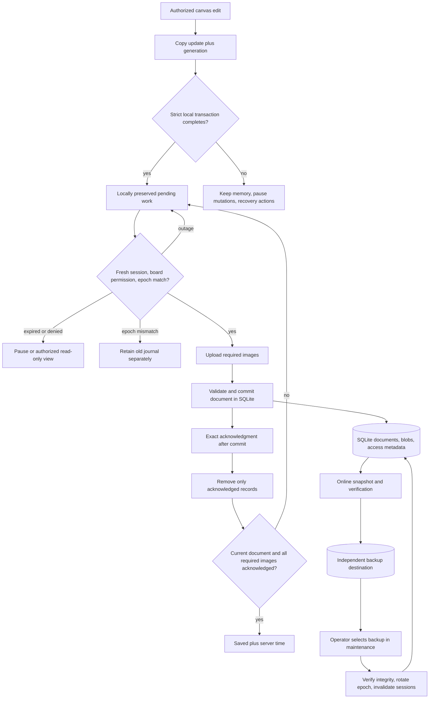

# Phase 04: Durable Boards and Recovery — Research

<user_constraints>
## User Constraints (from CONTEXT.md)

The following decision text is copied verbatim from the approved context; it is a requirement, not an implementation claim. [CITED: .planning/phases/04-durable-boards-and-recovery/04-CONTEXT.md]

### Save status and failures

- **D-01:** Keep save problems beside the board title, with details available on click. Preserve the existing last-save age presentation. The user selected this instead of a persistent banner or blocking failure dialog.
- **D-02:** Retry failed saves automatically in the background. Details offer **Retry now** and **Download recovery copy**. The recovery copy includes pending changes and images available in that browser.
- **D-03:** When board content saves but an image upload fails, show **Image not saved** beside the title. Details identify the affected image and offer recovery actions. Show **Saved** only after content and images are confirmed saved.
- **D-04:** If saving has failed or stalled and the user tries to leave, warn that some changes have not reached the server and let them stay or leave. Preserve pending work locally where possible. This warning addresses unresolved save problems; routine short saves were not assigned a blocking confirmation.

### Interrupted work

- **D-05:** For an already open board during temporary connection loss or service outage, continue editing with changes preserved locally and visibly pending. Send them after reconnection and a fresh access check. A known expired session still pauses editing until sign-in.
- **D-06:** When the same board is reopened in the same browser, recover pending work automatically after confirming the same account and editing permission. Retry saving and show recovery progress beside the title.
- **D-07:** If local recovery storage becomes full or unavailable during an outage, pause further editing. Keep existing work visible and offer **Download recovery copy** and **Retry saving**.
- **D-08:** Mark an accessible board card with **Changes waiting to save** in the browser holding pending work. Keep that indication until saving succeeds. Maintain account isolation; another account must not receive the pending work or its metadata.

### Deployment expectations

- **D-09:** Target an existing operator-managed **Kubernetes** platform for internal deployment.
- **D-10:** Planned maintenance is acceptable. The user explicitly allowed **up to one day when necessary**, overriding the proposed 5-, 15- and 30-minute options. Preserve pending work and recover it when service returns.
- **D-11:** No additional platform standards were imposed. Research proposes a portable deployment, including packaging, storage, ingress/TLS, secret handling and release procedure. Real operator configuration remains exclusively outside the public repository.

### Backups and restoration

- **D-12:** After loss of server storage requiring backup restoration, permit **at most one hour of recent acknowledged saved work to be lost** (recovery point objective, RPO: 1 hour).
- **D-13:** Retain backups for **30 days**.
- **D-14:** Restore usable service **within 24 hours** of a storage failure (recovery time objective, RTO: 24 hours). Include restoration of board content and images and verification that authorized members can reopen them.
- **D-15:** Restoration is **operator-initiated**: an operator selects a backup, follows the documented procedure and verifies the restored service before reopening access. Scheduled backups run automatically.

### Prior decisions carried forward

- Admission remains limited to approved internal members. Preserve effective Owner/Editor/Viewer capabilities, including Owner privileges for existing creators, account-isolated pending work and fresh authorization before replay.
- Session expiry pauses editing and preserves pending work. Deliberate sign-out ends the Dali session; pending work cannot replay into another identity or a board without current write permission.
- File import creates a new privately owned canvas from a Dali archive. The earlier optional **Copy local boards** workflow was removed by explicit user direction. PROJECT.md and current acceptance records supersede Phase 3 context D-16 on this point.
- Actual-provider configuration and acceptance remain deferred to backlog 999.4; assistive-technology speech and interaction acceptance remain deferred to 999.3. Keep generic deployment validation and actual-provider acceptance separately identified.

### Implementation discretion and research obligations

Research and planning choose mechanisms that meet these outcomes: durable acknowledgment, local journaling, retry timing, stalled-save detection, image failure attribution, archive completeness, portable Kubernetes packaging, storage, backup scheduling/retention and restore validation. No database migration, storage vendor, cluster version, chart format or cloud provider was selected in this discussion.

Investigate native browser navigation-warning limits, local storage failures, reload/crash recovery and stale local journals after server restore. Preserve authorization and do not allow automatic recovery to silently undo the selected restore or expose data across accounts. Resolve those mechanisms in research and planning; this discussion does not claim they are implemented.

A successful restoration must include the metadata and image associations needed to reopen boards under the applicable access rules. Backup freshness, retention and restoration-time targets need measured acceptance with synthetic data; define the representative validation dataset and operational prerequisites during planning.

### Deferred Ideas (OUT OF SCOPE)

No new deferred feature ideas were introduced. Existing real-provider and assistive-technology follow-ups retain backlog 999.4 and 999.3. Multi-user collaboration and convergence retain Phase 5 allocation.
</user_constraints>

**Researched:** 2026-09-25
**Domain:** Durable SQLite persistence, browser recovery journals, portable Kubernetes operations
**Confidence:** MEDIUM overall; source-confirmed code observations, documented APIs, and explicit deployment prerequisites. The confidence seam returned MEDIUM for Context7 even with verification and LOW for webfetch; direct primary citations below remain explicitly cited rather than being promoted by provider reputation.

## Summary

Retain the existing SQLite database as the atomic persistence and backup unit, including board documents, image bytes, ownership/grants, and operation receipts. Add explicit WAL/FULL settings and positive startup verification, then prove durability through a file-backed process restart and a browser with no cache. Existing document writes already merge and validate inside a synchronous transaction and reject references to absent images. Existing image writes recheck authority inside their transaction and return an acknowledgment. [VERIFIED: server/boards/documents.ts:74-91 — `database.transaction(() => {`, `return { acknowledged: true };`; server/boards/blobs.ts:119-129 — `return { acknowledged: true, key };`]

Make recovery a board-scoped state machine driven by immutable local records, exact acknowledgment coverage, current authorization, and a server recovery epoch. Capture edits at the Yjs update boundary; retain a local reconstruction checkpoint and required images; distinguish temporary network failure from known session expiry. The current journal captures when the document source pushes, whereas the native sync peer buffers updates and disconnects its listeners when a sync attempt exits. This is a concrete crash/outage gap to close. [VERIFIED: src/canvas/account/doc-source.ts:41-49 — `const token = await this.options.onPendingDocument?.(docId, copy);`; node_modules/@blocksuite/sync/src/doc/peer.ts:94-110,293-324 — `this.state.pushUpdatesQueue.push({`, `await this.source.push(id, merged);`, `this.disconnectDoc(docs);`]

**Primary recommendation:** implement one persistent server, one independent backup destination, an append-only local recovery path, and epoch-fenced replay. Preserve the approved UI contract and place operator restore behind an explicit maintenance procedure. These are selected implementation mechanisms under delegated discretion; measured acceptance remains required. [CITED: .planning/phases/04-durable-boards-and-recovery/04-CONTEXT.md]

## Architectural Responsibility Map

The following ownership is the prescribed design derived from the approved phase outcomes. [CITED: .planning/phases/04-durable-boards-and-recovery/04-CONTEXT.md]

| Capability | Primary tier | Secondary tier | Responsibility |
|---|---|---|---|
| Mutation capture, offline preservation, status, navigation warning | Browser | IndexedDB | Capture immediately; announce local preservation only after completion; retain memory on failure |
| Access and restore fencing | API/backend | Browser | Verify identity, effective capability and epoch at every commit; browser stops stale callbacks |
| Document/image durability | Database/storage | API | One database, transactional validation, acknowledgment only after commit |
| Same-browser recovery/export | Browser | Authorized API reads | Reconstruct fixed snapshot and all referenced assets; preserve pending records |
| Static assets and TLS entry | Static frontend + platform ingress | API | One browser origin, explicit API routing, protected API responses |
| Scheduled backups | Backend maintenance module | Independent mounted storage | Consistent snapshot, verification, publication, freshness and retention |
| Disaster restore | Operator maintenance command | Kubernetes + storage | Quiesce, select/verify, restore to new storage, rotate epoch, verify, reopen |

<phase_requirements>
## Phase Requirements

Descriptions are copied from the approved requirements. [CITED: .planning/REQUIREMENTS.md:30-31,74-75]

| ID | Description | Research support |
|---|---|---|
| SAVE-01 | Users can reopen saved boards and their images from another authenticated browser after the service restarts. | Single-database durability, file-backed crash harness, cold-browser semantic/image comparison |
| SAVE-02 | Users can distinguish saved changes from pending changes or save failures. | Exact acknowledgment coverage, per-image failures, local journal state, all 36 UI predicates |
| OPS-01 | Deployment operators can deploy Dali and its required services on operator-managed infrastructure using documented configuration and startup procedures. | Container build, single-writer manifests, same-origin ingress, external secrets, probes and release runbook |
| OPS-02 | Deployment operators can back up and restore board documents and images and verify that restored boards reopen with their content intact. | Online backup API, independent destination, retention/freshness evidence, offline restore and epoch fence |
</phase_requirements>

## Project Constraints (from AGENTS.md)

Actionable directives carried into planning: keep all code, planning, fixtures, logs and publishable history organization-neutral; use synthetic data/example domains; keep real identity settings, credentials, host paths, tenant identifiers, infrastructure settings and private evidence exclusively outside the repository. Preserve upstream notices. Review staged content/history before publication; stop publication and prepare reviewed remediation if history contains private material. Personal authorship attribution is permitted. [CITED: AGENTS.md]

Use GSD; read scope, requirements and roadmap; deliver phases sequentially; research before planning, check plans before execution, verify requirements after implementation. Execute automatically inside approved plans; pause for real blockers/consequential choices. Parallel work requires explicit ownership. Follow project model settings; verify static errors before commits and relevant checks before a PR; keep PR text concise. Preserve approved product boundaries, including deferred integrations and Phase 5 collaboration allocation. [CITED: AGENTS.md]

The session additionally requires current Context7 lookups for library/service documentation, source names and full links, technical implementation/validation detail, English planning artifacts and downloadable Markdown. Do not alter unrelated user work. This research owns only this artifact and is intentionally uncommitted per its assignment. [CITED: session task and user-provided AGENTS instructions]

## Standard Stack

Use installed, pinned technology; this phase does not need a new runtime package. Manifest values below are verbatim observations, not assertions that these are the newest registry releases. [VERIFIED: package.json:40-58,60-70]

| Component | Existing manifest value | Use |
|---|---|---|
| SQLite binding | `"better-sqlite3": "13.0.3"` | Existing transactions, BLOB storage, online backup |
| HTTP service | `"fastify": "5.12.5"` | Existing authorization and document/image routes |
| Native canvas | `"@blocksuite/affine": "0.22.4"` | Existing model, snapshot/archive adapters |
| Document format | `"yjs": "13.6.31"` | Updates, reconstruction and state comparison |
| UI | `"react": "^18.3.1"` | Existing shell and disclosure surfaces |
| Unit/server runner | `"vitest": "4.1.11"` | State-machine, storage and API verification |
| Browser runner | `"@playwright/test": "^1.62.1"` | Native IndexedDB and browser lifecycle coverage |
| Browser persistence | Native IndexedDB | Keep current native API; strict transactions and structural validation |

A local in-memory binding probe successfully loaded SQLite 3.53.4 and reported synchronous value 2. That proves the installed native module loads here; it does not prove persistent-volume durability or the proposed Linux image works. [VERIFIED: research command output — `{"sqlite":{"version":"3.53.4"},"journal":"memory","synchronous":2}`]

For the production container select the current Node 24 LTS line, pin a concrete image digest during execution and test the installed binding in that image. Node's official release table lists Node 24 as LTS and Node 26 as Current. The local Node version differs; a passing local build cannot replace the container smoke. [CITED: https://nodejs.org/en/about/previous-releases]

### Package Legitimacy Audit

No new package or upgrade is selected. The existing SQLite package was discovered in source and corroborated by official documentation through Context7. The required registry probe failed with `ENOTFOUND registry.npmjs.org`; version publish date and registry postinstall metadata were therefore not observed. The legitimacy seam returned `SUS`, with null registry signals and reasons `unknown-age`, `unknown-downloads`, `no-repository`. These report missing lookup evidence, not verified defects in the package. [VERIFIED: research command outputs]

| Package | Registry | Age/downloads/repository metadata | Verdict | Disposition |
|---|---|---|---|---|
| better-sqlite3 | npm | Lookup unavailable; official source is WiseLibs/better-sqlite3 | SUS from unavailable signals | Keep existing lock; **[WARNING: flagged as suspicious — verify before using.]** Re-run legitimacy/registry checks before a clean install or dependency change; if SUS persists, add checkpoint:human-verify |

Packages removed as SLOP: none. No npm-registry VERIFIED tag is earned. A clean container installation still requires accessible registry/artifact sources, lockfile integrity, native build validation and a successful provenance gate. [CITED: research probe results; https://github.com/WiseLibs/better-sqlite3]

### Alternatives considered

These are architectural comparisons under delegated discretion. SQLite retains current atomic board/blob storage with least migration risk. A service database and object store provide stronger independent scaling, but would require a two-store publication/backup protocol and a migration beyond this phase's need. Keep those as future scaling choices. For backup scheduling, an in-process bounded scheduler uses the active database connection; a CronJob is useful when an operator already has a safe trigger/destination, but should not mount the live single-pod database concurrently. [CITED: server/boards/blobs.ts:85-97; https://www.sqlite.org/backup.html; https://kubernetes.io/docs/concepts/workloads/controllers/cron-jobs/]

## Architecture Patterns

### System architecture

The diagram is the proposed implementation, not a claim of delivered behavior.



### Component responsibilities and source-verified seams

| Existing seam | Evidence and implication |
|---|---|
| Database opening | `const database = new Database(path);` followed by migrations, with foreign keys enabled; explicit journal/synchronous policy is absent from this opened function. Add configuration and read-back assertions here. [VERIFIED: server/storage/database.ts:14-29] |
| Document commit | `if (doc.store.pendingStructs || doc.store.pendingDs) throw new Error('Incomplete update');` and image existence validation already provide useful integrity boundaries. Preserve them and check epoch inside the same transaction. [VERIFIED: server/boards/documents.ts:21-22,74-91] |
| Blob storage | `bytes BLOB NOT NULL, hash TEXT NOT NULL` in the blob-table migration makes images part of the same backup unit. Preserve content-hash validation and referenced-image deletion prevention. [VERIFIED: server/boards/blobs.ts:89-97,115-128] |
| Journal | `kind: 'document' | 'blob'`, `indexedDB.open(databaseName, 1)`, `db.transaction('journal', mode, { durability: 'strict' })`, `tx.oncomplete = () => resolve(request.result);`. Keep completion semantics; add schema validation, epoch and an indexed scope query. [VERIFIED: src/canvas/account/outbox.ts:4-24] |
| Runtime | `new AccountJournal(initial, () => { queueMicrotask(() => { void interruptSession(); }); });` conflates storage failure and session interruption. Recovery currently starts with `replayJournal(options.descriptor, options.accountId, requestAbort.signal)` before workspace creation. Separate these lifecycle concerns. [VERIFIED: src/canvas/runtime.ts:91-104] |
| Status | `export type LocalSaveState = 'saving' | 'saved' | 'failed';`, `label: 'Saved locally'`, and `blobFailure = error === undefined ? null : failureMessage(error);` are too coarse for the contract; an unrelated success can clear an image error. Replace with scoped coverage/per-image state. [VERIFIED: src/canvas/save-status.ts:3,30-36,76-79] |
| Export | Existing exporter validates all referenced assets but calls live authorization before preparation and before download. Factor archive assembly from authority strategy so recovery can operate during a temporary outage under the valid already-open scope. [VERIFIED: src/canvas/export-board.ts:148-184 — `const catalog = { title: await authorize() };`, `await confirm();`] |
| Entry point | `await app.listen({ host: '127.0.0.1', port: Number(process.env.PORT ?? 3000) });` needs an explicit production bind interface for container networking. Preserve loopback default for local use. [VERIFIED: server/app.ts:73-76] |

New module/file names are planner decisions. Group server durability/epoch checks, backup/restore maintenance commands, browser journal/checkpoint logic, recovery coordinator, state aggregation and UI into independently testable modules. Keep raw native model and auth APIs behind the existing adapters.

### Durable acknowledgment and image atomicity

Select WAL plus FULL on every writable connection; read back the effective values and fail startup on incompatible storage/configuration. Put database, WAL and shared-memory companions on one persistent volume. SQLite WAL requires same-host shared-memory semantics; require a filesystem/block-backed CSI volume suitable for SQLite and flush/locking semantics confirmed by the operator. Do not infer suitability from a PVC being Bound. [CITED: https://www.sqlite.org/wal.html; https://www.sqlite.org/pragma.html#pragma_synchronous]

Keep images immutable by hash. Upload/commit each required image first; merge and validate referencing document bytes in one transaction with current board authority and epoch. An orphan image from an interrupted operation is acceptable; a committed reference without an image is not. Return success only after the transaction wrapper returns; catch commit/storage failure before acknowledgment serialization. Saved is an aggregate of the current local edit coverage and all referenced image acknowledgments, not a successful HTTP dispatch. [CITED: https://github.com/WiseLibs/better-sqlite3/blob/master/docs/api.md; server/boards/documents.ts:74-91; server/boards/blobs.ts:119-129]

Avoid changing the existing content-first error semantics merely to force an image-failure label. The UI's image-only failure condition applies where content is already acknowledged; when new content references an unuploaded image, both remain pending/failed and the combined state is used. Preserve the approved status precedence. [CITED: .planning/phases/04-durable-boards-and-recovery/04-UI-SPEC.md, Save and Recovery Interaction Contract]

### Local capture, crash recovery and races

Prescribed algorithm under D-05–D-08:

1. After authorized hydration, establish a versioned checkpoint containing the complete root/content baseline, captured title and referenced asset mapping. Attach independent Yjs update listeners before permitting new mutations. Copy each local update immediately into memory and queue its strict IndexedDB append; do not wait for network sync. Use explicit hydration/replay origins to avoid recapturing applied remote data. Yjs documents update events and origin-aware application. [CITED: https://docs.yjs.dev/api/document-updates]
2. Use an immutable random record ID, stable account/board scope, server epoch, document identity, schema version, monotonically assigned local sequence and originating tab ID. These are **proposed fields**, not current API values. Keep sequence allocation/checkpoint compaction in one IndexedDB transaction; avoid relying on the current in-memory generation as a persistent total ordering.
3. Preserve required image bytes independently of their network upload lifetime. Cache images for the open board as authorized reads complete; a pending recovery bundle must retain the baseline and its available images even after an upload acknowledgment. A journal of deltas alone cannot reconstruct an older board after restore. Missing baseline/image bytes must produce the approved recovery error, never a fabricated blank document or incomplete success archive.
4. Await transaction completion before claiming local preservation. Copy Blob bytes before opening the transaction, as the existing implementation does. Avoid unrelated await operations inside an active IndexedDB transaction. Request persistent storage where supported, handle denial normally, and measure quota usage only as an estimate. Browser clearing/eviction remains a real limit. [CITED: https://w3c.github.io/IndexedDB/; https://developer.mozilla.org/en-US/docs/Web/API/Storage_API/Storage_quotas_and_eviction_criteria; src/canvas/account/outbox.ts:38-44]
5. Network submissions carry the exact set of immutable record IDs they cover. Delete only those IDs after a valid matching acknowledgment and an access-generation recheck; an older response cannot clear newer edits. Compaction replaces only its exact input set atomically and preserves records added by other tabs. Repeated replay is safe at the data layer through Yjs/hash idempotency; queue ownership and acknowledgment bookkeeping still require tests. [CITED: https://docs.yjs.dev/api/document-updates; src/canvas/account/outbox.ts:75-89]
6. Keep one drain per runtime, with cancellation and generation guards. Cross-tab notifications contain invalidation only; reread scoped IndexedDB after authorization. Test concurrent tabs/late acknowledgments even though multi-user convergence is Phase 5.
7. On failed/blocked local writes keep the latest bytes in memory and enter a storage pause independent of session state. Guard native model setters, canvas gestures, title rename and menus; leave pan/zoom/selection/details/export available. Resume only after preservation or server acknowledgment succeeds and current permission is confirmed. Existing mutation guards are the integration seam. [CITED: src/canvas/account/mutation-guard.ts:20-65; .planning/phases/04-durable-boards-and-recovery/04-UI-SPEC.md]
8. Use bounded retry with one in-flight attempt: recommended delays 1, 2, 4, 8, 16, then 30 seconds with jitter; classify a request as stalled at 15 seconds and abort at 30 seconds. These are delegated implementation defaults, not performance promises. Keep a known error visible during retry. Manual retry coalesces with the drain; reconnect requires fresh access first. Suppress or coordinate the native peer's retry so two mechanisms do not race. Its current loop contains `setTimeout(resolve, 5 * 1000);`. [VERIFIED: node_modules/@blocksuite/sync/src/doc/peer.ts:329-354]
9. Keep ordinary saving visible until both local completion and server coverage are known. A tab/process killed before its current IndexedDB transaction completes can lose that unconfirmed edit; never label it locally preserved. Crash acceptance must distinguish committed journal entries from a deliberately interrupted transaction. Native navigation warnings cannot guarantee preservation. [CITED: https://developer.mozilla.org/en-US/docs/Web/API/IDBDatabase/transaction; https://developer.mozilla.org/en-US/docs/Web/API/Window/beforeunload_event]

### Authorization and server-restore epoch

Add a persistent random deployment recovery epoch initialized once by migration. Expose it in authorized descriptors and successful save responses; require the expected epoch on all document/blob writes and other replayable mutations. Compare it inside the same transaction that rechecks identity and capability. Missing or mismatched epochs must produce a distinct typed recovery outcome. A successful ordinary restart retains the epoch. An operator restore writes a new random epoch **after copying the selected backup and before serving traffic**. Never use a restored integer counter, a board revision, timestamps, or the browser access generation as a substitute. This is the selected fencing design under the explicit stale-journal research obligation. [CITED: .planning/phases/04-durable-boards-and-recovery/04-CONTEXT.md; server/boards/routes.ts:23-44]

On reentry: fetch current session, then board descriptor, then inspect the matching account journal; do not expose cached metadata before this authorization. Compare epoch before applying any local update to the live server workspace. An old epoch is quarantined, keeps its library marker, and is never rewritten to the new epoch by retry. Explicit Open restored board creates a clean runtime scoped to the new epoch and leaves old records separately available under current authority. Cold recovery with malformed or incomplete data displays the approved distinct error.

Preserve the same identity checks on blob requests, editable download completion, metadata mutations and journal marker reads. Existing role/capability definitions are `'owner' | 'editor' | 'viewer'` and `'read' | 'image' | 'presentation-export' | 'write' | 'rename' | 'editable-export' | 'duplicate' | 'grants' | 'delete'`; Owner retention and effective system-Viewer enforcement happen in the current guard. [VERIFIED: server/boards/routes.ts:12-31]

Restore must invalidate restored sessions/login transactions, preserve stable member/owner/grant associations and require fresh sign-in. Restoring a backup also rolls access metadata back; the operator must reconcile grants revoked after the selected recovery point before reopening ingress. This is a restore security prerequisite, not permission to create a second private policy database in the repository. Active stale clients must fail epoch checks even if they obtained an old request before restore.

### Recovery archive

Factor a pure snapshot-to-archive builder from the current exporter. At activation, synchronously capture fixed document/title/asset IDs; gather bytes from retained memory, durable local storage and current authorized reads; validate each reference/hash before the sole browser handoff. Later edits remain separate pending records. Import the result through the existing private-board import and compare semantic text/geometry/mind-map/crop/style/image relationships, accounting for deliberately regenerated identities. The current archive assembly uses `createAssetsArchive(job.assets, ids)` and `zip.generate()`. [VERIFIED: src/canvas/export-board.ts:165-184]

For an already-open temporarily offline board, authorize **local-only** recovery from its still-unexpired, same-account, last-confirmed writable scope and current interruption state; recheck that scope immediately before handoff. This is the chosen mechanism allowing the explicitly required outage download. Known expiry, denial, account switch or write downgrade prevents editable handoff. Fresh network authorization is required for server reads, replay and cold reopening. A paused storage state must not be mistaken for loss of authorization. This design does not assert knowledge of a remote revocation that cannot be reached; Phase 5 retains active-session revocation acceptance. [CITED: approved D-02, D-05, D-07 and UI account/recovery contract]

Beforeunload uses browser text, requires prior interaction and is unreliable on some lifecycle paths. Add it only while a failed/stalled save makes leaving risky; use the approved in-app Stay/Leave dialog for application navigation and continuous journaling for durability. Download handoff means Recovery copy ready; it never acknowledges pending records or proves a disk save. [CITED: https://developer.mozilla.org/en-US/docs/Web/API/Window/beforeunload_event; .planning/phases/04-durable-boards-and-recovery/04-UI-SPEC.md]

## Deployment, Backup and Restore Design

### Portable Kubernetes packaging — D-09–D-11

Select a multi-stage OCI build with a pinned Node 24 LTS runtime, compiled server and built static frontend. Serve static files through a small established web-server container in the same pod, reverse-proxying API/auth to the backend loopback port; this preserves the current service bind and gives one same-origin service entry. Alternatively the planner may implement an explicit backend bind plus separate static deployment, but choose one topology and test the real entry route. Do not ship the synthetic identity development launcher as production startup. [CITED: server/app.ts:73-76; docs/access-acceptance.md, Server configuration]

Use a one-replica Deployment with Recreate, a dedicated persistent live-data PVC, and a separate independent backup mount. Prefer ReadWriteOncePod where the operator CSI supports it; ReadWriteOnce alone permits multiple pods on the same node. For the fallback require explicit single-writer operational fencing and never force-delete/relaunch an uncertain old writer. Do not horizontally scale this SQLite deployment. A partitioned old writer must be fenced before another starts. [CITED: https://kubernetes.io/docs/concepts/storage/persistent-volumes/]

Provide generic Kustomize base/overlays, Service, optional Ingress/TLS reference, secret references, resources and startup/readiness/liveness probes. Require existing operator ingress, TLS, OIDC settings and storage class choices as external inputs. Readiness checks configuration/migrations and database readiness; liveness must not restart a healthy process merely because the identity provider or backup destination is down. Add graceful shutdown/drain and bounded termination. Use nonroot containers, read-only root filesystem plus explicit writable mounts, dropped capabilities and no Kubernetes API token where unnecessary. Kubernetes probes distinguish startup from periodic readiness/liveness. [CITED: https://kubernetes.io/docs/concepts/workloads/pods/probes/; https://kubernetes.io/docs/concepts/security/security-checklist/]

TLS termination requires explicit trusted-proxy handling for secure session cookies. Test the HTTPS ingress path, spoofed forwarding headers and redirects; do not solve this with production insecure-cookie fallback. Supply existing server variables by Secret/ConfigMap references; real values remain external. Kubernetes Secret objects require operator encryption/RBAC controls; the object alone does not establish encryption. [CITED: server/app.ts:19-47,67-69; https://kubernetes.io/docs/concepts/configuration/secret/]

Release procedure: validate configuration and capacity, create/verify a pre-upgrade backup, announce maintenance, stop ingress/drain, deploy one writer, run additive migrations, verify authorized cold-browser access, reopen ingress. Binary rollback is allowed only against a compatible schema; restoring an older database uses the epoch-changing restore procedure. Track elapsed planned maintenance separately from disaster restore; both approved ceilings are 24 hours. [CITED: approved D-10 and D-14]

### Automatic backup — D-12, D-13, D-15

Implement a maintenance module in the live server using its existing connection and the official asynchronous backup API. Run automatically on startup when due and at a 15-minute cadence, one job at a time. This avoids a second pod mounting the live RWOP database. Persist enough schedule/completion metadata to recover after process restart; missed timers trigger a due check rather than a pile of duplicate jobs. Keep scheduling separate from database snapshot logic for deterministic tests. The official binding permits incremental backup while active; writes from another connection can restart progress. [CITED: https://github.com/WiseLibs/better-sqlite3/blob/master/docs/api.md]

Publication protocol: create a unique temporary snapshot; await completion; open the copy and run database/foreign-key checks plus document decoding/reference/hash checks; close it; compute a full-file digest and a versioned manifest; flush files; publish atomically on the destination filesystem; flush directory metadata; mark complete last. Never select a partial/unverified backup. Store manifest schema/application version, database migration version, conservative snapshot-start recovery point, completion time, size, digest and aggregate counts. These are proposed backup fields. A copy on the live-data volume is staging only; success requires verified publication on independently surviving storage.

Use a generic mounted destination contract rather than adding an unselected cloud SDK. **[ASSUMED A1]** The operator can supply a destination whose failure domain survives loss of live server storage, with adequate capacity, durable flush/rename semantics and restricted access. Verify this privately before OPS acceptance; two PVC names do not prove independence. Protect backup data at rest through operator storage controls and restrict restore/delete authority. Maintain at least 30 days of complete recovery points; prune only older complete sets after a newer verified copy exists. Retain the last good copy even when stale; alert on inability to meet retention/capacity.

A schedule is not proof of RPO. Measure age from the conservative recovery point of the latest independently verified complete backup, not job start, last timer or last local snapshot. Recommended alert at 45 minutes; **by 60 minutes reject new durable mutations until a verified backup reestablishes the bound**, retaining browser work locally and reporting pending. Check this inside write admission as well as on a timer, so a delayed event loop cannot admit unsafe writes. Fail closed on startup without a valid fresh baseline. This selected availability tradeoff enforces the approved maximum exposure rather than silently converting failed backups into an unbounded RPO. Obtain an initial backup before admitting production writes; include a documented recovery path when the backup destination is unavailable. Measure degraded-mode behavior in validation.

Countercheck: Kubernetes CronJobs can miss or duplicate schedules, and Forbid only prevents overlap within one CronJob. Therefore merely deploying an hourly CronJob cannot establish a one-hour bound, even if it is substituted later for the selected scheduler. [CITED: https://kubernetes.io/docs/concepts/workloads/controllers/cron-jobs/]

### Operator restore — D-14, D-15

Prescribed ordered procedure:

1. Start the incident timer, block ingress and fence/stop the old writer. Select a complete backup; verify manifest/digest, supported schema and resource limits before changing destination state.
2. Restore into a fresh empty data location, keeping the old failed location for operator handling. Never overlay a selected database while old WAL/shared-memory companions or a writer can still act.
3. Verify database/foreign keys; decode every board document; validate bound identities, image references and exact hashes; retain board/member/grant/operation relationships. Clear restored sessions/login transactions and rotate the recovery epoch before traffic. Apply compatible forward migrations if required.
4. Reconcile access changes since the recovery point and attach external secret/identity configuration. Bring up one instance behind closed ingress, run authorized owner/editor/viewer/denied and image tests, then perform a cold-browser synthetic reopen.
5. Record selected recovery-point age, actual acknowledged work loss, restore timings and integrity results. Reopen ingress only after operator verification; complete RTO measurement includes usable authenticated service. Pending old browser work must encounter the epoch mismatch and never silently replay.
6. Reestablish a fresh backup baseline before admitting new mutations; verify automatic backups resume. Disaster RPO is at most one hour, retention 30 days, disaster RTO at most 24 hours. An ordinary service restart has zero acknowledged loss and retains its epoch. [CITED: approved D-12–D-15]

## Don't Hand-Roll

| Problem | Use | Avoid |
|---|---|---|
| Consistent live database copy | Existing SQLite online backup API | Copying just the live main database file while WAL writes continue |
| Document merge and serialization | Existing Yjs/BlockSuite adapters | JSON recreation of native objects or string-merging updates |
| Durable local transaction ordering | IndexedDB transaction completion | Treating individual request success as the commit |
| Image identity | Existing content hash and validation | Filename identity or silently accepting missing references |
| Editable archive | Existing compatible archive builder plus integrity checks | A parallel unversioned export format |
| Identity/session/board authority | Existing server guards | Trusting client roles, stored markers or restored sessions |
| Platform secrets/TLS | Operator Secret store and ingress | Committed values or custom crypto |

These are selected patterns grounded in current code and primary API documentation. [CITED: server/boards/documents.ts; server/boards/blobs.ts; src/canvas/export-board.ts; https://www.sqlite.org/backup.html; https://w3c.github.io/IndexedDB/]

## Runtime State Inventory

This phase changes persistence/recovery schema and deployment behavior. The inventory distinguishes inspected code from external state that was deliberately not queried.

| Category | Items and evidence | Required action |
|---|---|---|
| Stored data | Current journal database is created using `const databaseName = 'dali-account-recovery-v1';` and `indexedDB.open(databaseName, 1)`; SQLite opening is configured by `databasePath: required('DALI_DATABASE_PATH')`. [VERIFIED: src/canvas/account/outbox.ts:6-10; server/app.ts:42] | Additive database migration; versioned IDB upgrade preserving legacy rows. Rows without an epoch must be quarantined for current-authorized recovery, not silently adopted into a new epoch. Test already-open tabs during upgrade. |
| Live service config | Actual cluster/ingress/volume configuration was not accessed. [ASSUMED A1] | Operator records required storage, ingress and backup bindings privately; generic manifests cannot verify them. |
| OS-registered state | No OS registrations are required by the selected Kubernetes design; existing operator registrations were not inspected. [ASSUMED A2] | Do not rename/remove local launchers; confirm no second writer outside the deployment before production migration. |
| Secrets/env vars | Existing names include `DALI_DATABASE_PATH`, `DALI_SESSION_SECRET`, `DALI_OIDC_ISSUER`, `DALI_OIDC_CLIENT_ID`, `DALI_OIDC_CLIENT_SECRET`. [VERIFIED: server/app.ts:38,42-44] | Keep names; introduce only generic backup/maintenance settings in the plan. Restore keys/config from external operator management, not from public artifacts. |
| Build artifacts | Server compiler declares `"outDir": ".gsd/access-build"` and includes `"tests/oidc-provider.ts"`. [VERIFIED: tsconfig.server.json:9,18] | Add a production-only build/copy boundary; do not package test-provider startup. Rebuild native SQLite for the selected container target. |

## Common Pitfalls

- **Buffered edits outlive a failed sync attempt:** a network-push journal is too late. Keep independent local update capture and prove a second edit made during outage survives reload. [CITED: src/canvas/account/doc-source.ts:41-49; node_modules/@blocksuite/sync/src/doc/peer.ts:94-110,319-324]
- **Recovery never becomes visible:** replay-before-hydration can reject before any recoverable view exists. Separate authorization, validated local reconstruction, server hydration and replay; preserve an authorized inspection/export path when upload fails. [CITED: src/canvas/runtime.ts:94-114]
- **Storage failure looks like expiry:** local quota failure currently calls session interruption. Give mutation pause its own cause and keep display/export available under its authority. [CITED: src/canvas/runtime.ts:91]
- **New image success clears old error:** global error counters cannot meet per-image state. Key failures by board generation and immutable image ID; only matching success/confirmed obsolescence removes them. [CITED: src/canvas/save-status.ts:76-79]
- **Expired session hidden as an outage:** distinguish network/5xx from explicit auth responses and locally known absolute expiry; preserve deliberate sign-out. [CITED: src/auth/session.ts:128-150; approved D-05]
- **Browser snapshot resurrects a selected restore:** UUID epoch fencing belongs in server transactions, not just the UI. Test old requests and epochs even when cookies are newly authenticated. [CITED: approved stale-journal obligation]
- **Backup exists but is unusable:** verify document and image relationships, access metadata and cold browser access; test missing/corrupt files and exhausted destination. [CITED: approved OPS-02 and D-14]
- **PVC and local tests imply an RPO/RTO:** capacity, flush semantics, independent storage and credentials remain explicit external prerequisites. Measure in the supported deployment; do not label YAML validation an operational pass. [CITED: https://kubernetes.io/docs/concepts/storage/persistent-volumes/]
- **Replay of metadata breaks title recovery:** board-title mutations use an API path outside Yjs. The planner must deliberately journal/reconcile safe title intent or pause/disable its mutation during outage, preserving already entered text; do not imply every menu mutation is queued by document capture. The approved local-storage pause explicitly includes title changes. [CITED: .planning/phases/04-durable-boards-and-recovery/04-UI-SPEC.md]

## Code Examples

The following is a verified external-API pattern; `database` and `temporaryBackupDestination` are caller-provided values, not repository paths. Production wrapping must add the verification/publication steps above. [CITED: https://github.com/WiseLibs/better-sqlite3/blob/master/docs/api.md; https://github.com/WiseLibs/better-sqlite3/blob/master/docs/performance.md]

```ts
database.pragma('journal_mode = WAL');
database.pragma('synchronous = FULL');
database.pragma('foreign_keys = ON');

if (database.pragma('journal_mode', { simple: true }) !== 'wal' ||
    database.pragma('synchronous', { simple: true }) !== 2) {
  throw new Error('Durable storage configuration unavailable');
}
await database.backup(temporaryBackupDestination);
```

Independent local update capture uses the documented Yjs event/origin API. The callback below is illustrative and deliberately does not invent a journal method signature. Capture integration must handle promise failure by pausing further mutations and retaining memory. [CITED: https://docs.yjs.dev/api/document-updates]

```ts
const restoreOrigin = Symbol('restore');
doc.on('update', (bytes, origin) => {
  if (origin === restoreOrigin) return;
  const immutableBytes = new Uint8Array(bytes);
  queueDurableLocalAppend(immutableBytes); // proposed application callback
});
Y.applyUpdate(doc, validatedBaseline, restoreOrigin);
```

## State of the Art

| Existing approach in this repository | Phase 4 implementation |
|---|---|
| Status says Saved locally; one blob error slot | Server acknowledgment coverage and independently tracked image failures |
| Journal created at push boundary | Independent edit capture plus reconstructable local checkpoint |
| Per-runtime generation protects stale callbacks | Retain generation and add durable server restore epoch |
| Development/testing entry paths | Production container boundary and generic operator deployment |
| No phase-level measured backup acceptance yet | Automated snapshot validation plus timed storage-loss restore drill |

The left-hand observations are grounded in the source seams above; the right-hand column is the selected design. No dependency deprecation or upgrade is asserted. [CITED: src/canvas/save-status.ts; src/canvas/account/doc-source.ts; src/canvas/runtime.ts; .planning/STATE.md]

## Validation Architecture

Validation is enabled by `"nyquist_validation": true`. [VERIFIED: .planning/config.json: workflow definition]

### Existing test infrastructure

The manifest commands are `"test": "vitest run"`, `"test:server": "vitest run --config vitest.server.config.ts"`, `"test:browser": "playwright test"`, `"typecheck": "tsc --noEmit"`, `"typecheck:server": "tsc -p tsconfig.server.json --noEmit"`. Unit inclusion is `include: ['src/**/*.test.ts']`; server inclusion is `include: ['server/**/*.test.ts']`. [VERIFIED: package.json:28-38; vite.config.ts:156-160; vitest.server.config.ts:4-8]

| Property | Actual command/config |
|---|---|
| Quick browser-core unit run | `npm test -- src/canvas/account/outbox.test.ts src/canvas/account/doc-source.test.ts src/canvas/account/blob-source.test.ts src/canvas/save-status.test.ts` |
| Quick server regression | `npm run test:server -- server/boards/access.test.ts` |
| Static checks | `npm run typecheck` and `npm run typecheck:server` |
| Full established gate | `npm test`, `npm run test:server`, `npm run build`, `npm run test:access`, `npm run test:browser` |
| Startup script regression if touched | `npm run test:dev` |
| Browser projects | `'dev'`, `'prod'`, `'prod-firefox'`, `'prod-webkit'`, `'access'` [VERIFIED: playwright.config.ts:17-22] |

The command paths are existing inspected suites, not new-file existence claims. Budget unit selections under 30 seconds after warm dependencies; measure rather than promise the duration. Browser startup builds and runs synthetic identity services, so browser/restore gates have a larger measured budget. Browser slots are exclusive. The current access project uses an explicit regex of named suites: a newly named Phase 4 suite needs registration or explicit inclusion in the production projects. [CITED: playwright.config.ts:5-6,24-50; docs/access-acceptance.md]

### Requirement → failure injection map

The selectors below are **proposed tags to add**, not currently runnable acceptance evidence. Existing test scripts above run them after registration.

| Requirement | Automated acceptance | Planned focused selector | Wave 0 gap |
|---|---|---|---|
| SAVE-01 | Real file-backed server process: upload images + root/content; observe acknowledgment; SIGKILL; reopen same storage with fresh browser profile; compare semantic canaries and exact image hashes | `npm run test:server -- -t @04-restart`; browser `--grep @04-cold-reopen` | Spawnable file-backed fixture, deterministic commit/ack barriers |
| SAVE-01 | Kill before commit, after commit before response, after response; unacknowledged work may replay without duplication; all acknowledged work remains | `npm run test:server -- -t @04-commit-boundary` | Crash hooks isolated to tests, no production bypass |
| SAVE-02 | Disconnect, continue typing/import images, commit IDB, reload/crash; same account recovers; different account/denied viewer reads no old journal metadata | `npm exec playwright test -- --project=prod --grep @04-journal` | Native IndexedDB tests, cross-browser selection |
| SAVE-02 | Inject transaction abort/quota, image upload failure, delayed old acknowledgment, stalled request, corrupt journal, account switch during export, IDB version upgrade and two-tab writes | `npm test -- -t @04-recovery`; native suite tag `@04-recovery` | State reducer, clock and storage failure injection |
| OPS-01 | Build/run actual production image; configuration rejection, TLS ingress cookie, one writer, probes, PVC restart, SIGTERM drain | deployment smoke task | Running container daemon and disposable cluster |
| OPS-02 | Backup during writes; kill snapshot publication; corrupt snapshot/hash/missing image; restore on fresh storage, changed epoch, invalid sessions, cold authorized reopen | `npm run test:server -- -t @04-backup`; drill task | Backup/restore CLI and fixture generator |
| OPS-02 | Simulated 31-day retention boundary, duplicate scheduler starts, missed timer, wrong clock, backup failure; 60-minute write fence; actual measured backup/restore throughput | `npm run test:server -- -t @04-retention` | Injectable time plus actual I/O measurement |

Do not use constructed unload events as proof of browser warning display, or an in-memory database as proof of crash durability. Test fresh browser contexts with cleared storage and an actual restarted process. Require nonzero selected test counts and no required skip. [CITED: https://developer.mozilla.org/en-US/docs/Web/API/Window/beforeunload_event; server/boards/access.test.ts: existing in-memory fixture]

### Synthetic representative dataset and measured operational evidence

Select this reproducible validation envelope under delegated discretion: 50 boards owned across three synthetic identities; private and shared owner/editor/viewer cases; 100 ordinary editable objects per board; one board with 1,000 ordinary objects and 100 mind-map nodes; zero/one/many images; at least 50 distinct valid PNG/JPEG files with generated bytes totaling at least 128 MiB across the dataset; maximum representative individual image 8 MiB. Include frames, connector endpoints, collapsed branches, topic styles and crop/adjustment metadata. Use seeded generation and record actual object counts, byte counts, dimensions, schema/version, hashes and random seed. These are validation targets, not observed production usage or a capacity guarantee.

Keep the dataset within current declared limits: `{ update: 8 * 1024 * 1024, vector: 64 * 1024, objects: 10000 }` and `{ bytes: 16 * 1024 * 1024, pixels: 16_000_000, dimension: 8192, boardBytes: 256 * 1024 * 1024 }`. Boundary tests exercise limits separately. [VERIFIED: server/boards/documents.ts:8; server/boards/blobs.ts:12]

Write a unique timestamped canary at a known cadence through authorized APIs while automatic backups run. At failure record the latest acknowledged sequence; restore a selected complete backup into empty storage; record the newest included canary, its time gap and all document/image/access verification. Measure snapshot-start-to-independent-publication duration, latest recoverable point age, full database/backup size, retention capacity, failure-detection-to-usable-service duration and cold reopen. A compressed fake clock tests retention logic but cannot establish throughput or 24-hour operational response. Estimate 30-day capacity from measured backup size and chosen cadence, with explicit spare capacity and alert thresholds; do not claim deduplication/compression savings unless implemented and measured.

### Coverage of all 36 approved UI truths

Use the source's exact surface/category pair as the test identity. All entries below inherit the full acceptance wording and shared responsive matrix from the approved UI contract. These mappings prescribe implementation verification, not pass results. [CITED: .planning/phases/04-durable-boards-and-recovery/04-UI-SPEC.md:214-251]

| Surface | Categories (one test assertion group each) | Required oracle |
|---|---|---|
| E1 — 4 | loading; error; overflow; long-text | Title-adjacent state/last server time, precedence/ack coverage; responsive constraints |
| E2 — 8 | empty; loading; error; populated; partial; overflow; zero-one-many; long-text | Per-image labels/errors, focus stable through retry, no unrelated clearing, zero/one/50 rows |
| E3 — 6 | empty; loading; error; populated; overflow; long-text | Fixed snapshot, duplicate prevention, missing-image failure, actual import fidelity, no journal clearing |
| E4 — 6 | empty; loading; error; populated; overflow; long-text | Authorization first, visible recovery/denial/corruption/epoch distinction, valid focus restoration |
| E5 — 4 | loading; error; overflow; long-text | Safe default Stay, Escape, one Leave transition, unconfirmed-preservation warning, native limits |
| E6 — 8 | empty; loading; error; populated; partial; overflow; zero-one-many; long-text | Authorized account-only markers, independent inspection, 50 cards, unchanged ordering/time, ack-only clearing |

Run at the contract's 1440/900/600/490/320 widths, 200% native zoom, reduced motion, 200-character title and 120-character unbroken image-name fixtures. Assert keyboard focus/accessibility semantics and measured contrast; real spoken assistive-technology acceptance stays deferred. Map every group to D-01–D-08 and SAVE-02; OPS browser checks also exercise E4 and E6. [CITED: .planning/phases/04-durable-boards-and-recovery/04-UI-SPEC.md:251; approved deferrals]

### Sampling and Wave 0

Per implementation task: matching unit/server selections and both typechecks. Per browser wave: focused production Chromium plus Firefox/WebKit for native storage/lifecycle and changed UI. Phase gate: established full suite, production packaging smoke, actual storage-loss restore drill and 36-predicate evidence matrix before verify-work. Add fixtures and task-specific suites before coding behavior; no blanket new test framework is needed. These are planned checks; research did not run the full application gate.

## Security Domain

Security applies by default; use the current ASVS numbering rather than the older template's category numbers. OWASP's current index names authentication V6, session management V7, authorization V8, cryptography V11, secure communication V12, configuration V13, data protection V14 and file handling V5. [CITED: https://cheatsheetseries.owasp.org/IndexASVS.html]

| Applicable category | Phase control |
|---|---|
| V6/V7 authentication/session | Fresh identity before cold recovery/replay; absolute expiry; sign-out; invalidate restored sessions |
| V8 authorization | Server commit-time capability + epoch checks; account-isolated journals/markers/exports |
| V2 validation/business logic; V5 file handling | Bounded journal/manifest/archive schemas, known document identity, image MIME/hash/size checks, fail-closed malformed records |
| V11 cryptography; V12 communication | Existing cryptographic hashes and random epoch generation; operator TLS/storage encryption; no custom crypto |
| V13 configuration; V14 data protection | External secrets, restricted mounts/backups, generic public evidence, independently protected retained data |
| V16 logging/error handling | Generic user errors, sanitized operational counters and measured failure outcomes without board/session content |

| Threat | STRIDE | Mitigation and failure probe |
|---|---|---|
| Old browser restores unwanted content | Tampering | Epoch checked in transaction; submit stale epoch with valid fresh identity |
| Account switch leaks recovery data | Information disclosure | Current identity before reads/handoff; switch during IDB/export async completion |
| Restored session/grant revives access | Elevation of privilege | Invalidate sessions and operator permission reconciliation before ingress |
| Corrupt or huge archive/snapshot | Tampering/denial of service | Size/schema/digest/decode checks before restore; inject malformed references and over-limit bytes |
| Backup writes share live disk failure | Availability | Independently surviving destination; delete live storage and restore from destination |
| Disk full or stale backup still gets ack | Data loss | Commit failure returns no ack; freshness fence and failed snapshot never count as success |

Controls are this phase's proposed verification obligations, not a claim of ASVS certification.

## Environment Availability

| Dependency | Observation this session | Execution consequence |
|---|---|---|
| Node/npm | Node v26.7.0; npm 11.19.0 | Local research runtime available; selected Node 24 production image still needs validation |
| Installed SQLite binding | Loaded successfully; SQLite 3.53.4 | Local native tests possible |
| Docker | Client 29.7.2; daemon connection failed | Container build/run blocked until daemon or a CI runner is supplied |
| kubectl | Client v1.36.1 with Kustomize v5.8.1 | Render/client operations available; no cluster context or credentials inspected |
| Disposable Kubernetes cluster | Not established; kind command unavailable | Provide isolated test cluster or operator/CI validation environment |
| npm registry | ENOTFOUND lookup failure | Clean build/provenance lookup needs reachable registry |
| Independent backup volume, TLS/OIDC, monitoring | Operator prerequisites, uninspected | Configure privately; actual-provider acceptance remains deferred |

Observations above are research tool outputs, not statements about an actual production system. Missing daemon/cluster/registry access blocks the corresponding execution evidence, not research/planning. No fallback may substitute YAML rendering for a working deployment or a local file copy for independent disaster recovery.

## Assumptions Log

| ID | Claim | Risk and required confirmation |
|---|---|---|
| A1 | Operator can supply independently surviving, correctly flushing/locking live and backup storage with sufficient capacity | Confirm storage semantics/failure domains privately and execute storage-loss drill before OPS acceptance |
| A2 | No external OS-registered process is concurrently writing the deployed database | Inventory/fence writers in target environment before migration |

All timings, retry defaults, dataset sizes and topology selections above are **delegated design choices to implement and validate**, rather than unverified claims about current deployment capabilities. The registry's missing metadata and untested Node 24 image are explicit unobserved prerequisites, not compatibility exclusions.

## Planner Resolutions

All seven planning questions below have selected mechanisms and owning tasks. These are design resolutions; implementation, package provenance and operational acceptance retain their separate execution gates.

| Prior question | Selected resolution | Owning plan/tasks |
|---|---|---|
| Q-01: Portable runner/cluster and identity validation | Build pinned production app/web images and exercise them with synthetic TLS/OIDC; use an explicitly disposable, named Kubernetes context/namespace for deployment and restore drills. Actual-provider acceptance retains backlog999.4. | [04-13-PLAN.md](04-13-PLAN.md) (tasks04-13-01/02: build and image smoke), [04-14-PLAN.md](04-14-PLAN.md) (task04-14-02: deployment harness), [04-15-PLAN.md](04-15-PLAN.md) (task04-15-02: actual cluster drill). External gates E-01/E-03 remain pending. |
| Q-02: Storage topology and backup destination | Retain one SQLite writer with Recreate and ReadWriteOncePod where supported; fallback ReadWriteOnce requires explicit old-writer fencing. Keep DB/WAL/SHM together and publish verified backups to independently surviving storage. Use15minute cadence,30day retention and45minute alerting; operator storage/encryption/alert bindings stay external. | [04-10-PLAN.md](04-10-PLAN.md) (tasks04-10-01/02: complete publication and storage contract), [04-11-PLAN.md](04-11-PLAN.md) (task04-11-01: schedule/retention/health), [04-14-PLAN.md](04-14-PLAN.md) (task04-14-01: storage packaging), [04-15-PLAN.md](04-15-PLAN.md) (task04-15-02: independent-loss proof). External gate E-02 remains pending. |
| Q-03: Recovery, epoch and manifest contracts; legacy journals | Define authorized descriptor/ack epoch and typed mismatch outcomes in04-02-01/02 before downstream transports consume them; define RecoveryOutcome with the coordinator in04-04-01; define versioned BackupManifest in04-10-01 before scheduler/restore consumers. Version2 journal migration retains epoch-less version1 records quarantined, with native preservation tests in04-03-01. | [04-02-PLAN.md](04-02-PLAN.md) (epoch interface), [04-03-PLAN.md](04-03-PLAN.md) (journal migration), [04-04-PLAN.md](04-04-PLAN.md) (recovery outcomes), [04-10-PLAN.md](04-10-PLAN.md) (backup manifest). Design resolved; tests are NOT_RUN. |
| Q-04: Snapshot export during storage pause | Separate canMutateCurrentScope from canExportRecoveryScope; build a fixed authorized snapshot from retained memory/checkpoint/image bytes while mutations are paused. Recheck identity/generation before handoff and fail with an explicit missing-image error if required bytes are unavailable. | [04-04-PLAN.md](04-04-PLAN.md) (task04-04-02: independent predicates), [04-06-PLAN.md](04-06-PLAN.md) (tasks04-06-01/02: paused snapshot/export evidence). Design resolved; tests are NOT_RUN. |
| Q-05: Outage rename semantics | Preserve the latest account/board/epoch-scoped title intent with base revision and operation receipt; replay only after fresh authority and epoch validation. Keep grants/delete/duplicate outside document-journal replay. | [04-08-PLAN.md](04-08-PLAN.md) (task04-08-01: title intent), [04-02-PLAN.md](04-02-PLAN.md) (tasks04-02-02/03: metadata epoch boundaries), [04-11-PLAN.md](04-11-PLAN.md) (task04-11-03: grant write admission). Design resolved; tests are NOT_RUN. |
| Q-06: Enforceable backup freshness and user recovery | Alert at45minutes and reject durable mutations transactionally at60minutes or uncertain/no baseline using typed503/BACKUP_FRESHNESS_REQUIRED. Keep authorized browser edits locally pending and replay after verified coverage and fresh authorization; document the alert/fence/recovery sequence. Server guards precede browser integration, which consumes completed coordinator/status fixtures. | [04-11-PLAN.md](04-11-PLAN.md) (tasks04-11-01/02/03: schedule and complete API fencing), [04-15-PLAN.md](04-15-PLAN.md) (task04-15-03: pending-to-Saved browser proof/runbook; task04-15-02: measured RPO/maintenance drill). Design resolved; tests are NOT_RUN. |
| Q-07: Unwritable research cache and unavailable registry lookup | Use this repository research artifact and its direct primary citations as the planning reference; no global-cache dependency is required. Retain the current lockfile and require registry/source/integrity checks before clean container installation. Substantive unresolved SUS/ASSUMED provenance blocks installation for human review. | [04-13-PLAN.md](04-13-PLAN.md) (task04-13-01: provenance preflight). Cache handling is resolved; external gate E-04 remains pending. |

## External Execution Prerequisite Gates

No gate below has gained new execution evidence from planning. Missing prerequisites keep the associated acceptance blocked; static manifests and unit tests retain their narrower evidentiary scope.

| Gate | Required execution evidence | Owner | Current status |
|---|---|---|---|
| E-01: Container runner | Working daemon/runner, successful pinned image builds, Linux native SQLite load and actual IMAGE_SMOKE_PASS including TLS/auth/restart checks. | 04-13-01/02 | PENDING; research observed daemon connection failure. |
| E-02: Storage and exclusive writer | Private confirmation of A1 independent failure domains,flush/locking semantics,access mode,capacity,retention/encryption/alert bindings and A2 absence/fencing of a second writer; real independent storage-loss restore evidence. | 04-14-01 and04-15-02 | PENDING; no operator storage or independent-loss acceptance is claimed. |
| E-03: Disposable cluster | Explicit authorized disposable context/namespace,available images,synthetic TLS/OIDC and live/backup storage; actual DEPLOYMENT_SMOKE_PASS and complete timed RECOVERY_DRILL_PASS. | 04-14-02 and04-15-02 | PENDING; cluster/runtime/timing acceptance has not run. |
| E-04: Package provenance | Reachable registry plus pinned better-sqlite3 source/version/integrity metadata and lockfile provenance; resolve the research SUS result before clean install or stop for blocking review. | 04-13-01 | PENDING; research DNS lookup failed and registry provenance remains unverified. |

## Sources

Primary source names and full links:

- SQLite, WAL: https://www.sqlite.org/wal.html
- SQLite, synchronization/foreign-key/integrity pragmas: https://www.sqlite.org/pragma.html
- SQLite, online backup API: https://www.sqlite.org/backup.html
- WiseLibs better-sqlite3, API: https://github.com/WiseLibs/better-sqlite3/blob/master/docs/api.md
- WiseLibs better-sqlite3, durability note: https://github.com/WiseLibs/better-sqlite3/blob/master/docs/performance.md
- Yjs, document updates: https://docs.yjs.dev/api/document-updates
- W3C, IndexedDB specification: https://w3c.github.io/IndexedDB/
- MDN, IndexedDB transaction: https://developer.mozilla.org/en-US/docs/Web/API/IDBDatabase/transaction
- MDN, browser storage quotas/eviction: https://developer.mozilla.org/en-US/docs/Web/API/Storage_API/Storage_quotas_and_eviction_criteria
- MDN, beforeunload limits: https://developer.mozilla.org/en-US/docs/Web/API/Window/beforeunload_event
- Kubernetes, persistent volumes: https://kubernetes.io/docs/concepts/storage/persistent-volumes/
- Kubernetes, probes: https://kubernetes.io/docs/concepts/workloads/pods/probes/
- Kubernetes, CronJob semantics: https://kubernetes.io/docs/concepts/workloads/controllers/cron-jobs/
- Kubernetes, Secrets: https://kubernetes.io/docs/concepts/configuration/secret/
- Kubernetes, security checklist: https://kubernetes.io/docs/concepts/security/security-checklist/
- Node.js, supported release lines: https://nodejs.org/en/about/previous-releases
- OWASP, current ASVS index: https://cheatsheetseries.owasp.org/IndexASVS.html

Context7 resolution/query used official-project IDs for better-sqlite3, Kubernetes and Yjs. IndexedDB resolution returned wrapper libraries; native W3C/MDN documentation was used instead. No wrappers were installed. Official pages were consulted on the research date; rolling documentation publication dates do not establish a package release date.

## Metadata

- Standard stack confidence: MEDIUM. Existing manifest and installed native binding are observed; current registry/publish metadata could not be fetched.
- Architecture confidence: MEDIUM. Core storage/browser APIs are documented; production container, target volumes and cluster remain untested.
- Pitfalls confidence: MEDIUM. Concrete code seams and documented platform limits; acceptance tests must reproduce failures.
- Research date: 2026-09-25. Recheck operator environment, image digest, dependency legitimacy and current source before execution; refresh after substantial source changes.
- Scope: research only; no application code, deployment, branch or commit changed by this task.
